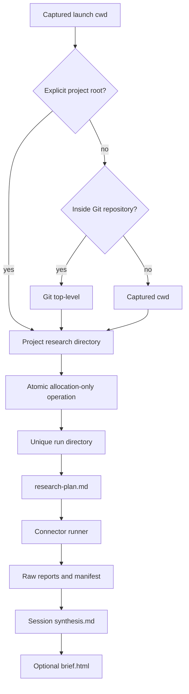

# Project-Local Deep Research Artifacts - Plan

## Goal Capsule

- **Objective:** Make every deep-research skill run keep its mandatory research plan and generated artifacts under the project from which the skill was launched, then migrate the existing Zeus mobile-RTS research into that layout.
- **Authority:** The user's project-local storage directive overrides the current global-path examples; this plan defines implementation details that the request leaves open.
- **Execution profile:** Small stdlib-only Python change, implemented test-first, followed by skill/documentation updates and a checksum-safe one-time migration.
- **Stop conditions:** Do not overwrite a conflicting destination, delete a legacy artifact before content verification, or let plugin-directory changes replace the captured launch directory.
- **Tail ownership:** `ce-work` owns implementation, verification, review, migration, and compounding of the durable convention.

---

## Product Contract

### Summary

A deep-research skill invocation will create one self-contained run beneath the invoking project's root-level `research/` directory. The pre-run research plan, channel reports, synthesis, and optional HTML brief will live together, while the existing Zeus research is migrated into the same structure. Direct Python CLI use remains a lower-level raw-evidence runner and does not claim to author a research plan or synthesis.

### Problem Frame

The skill currently instructs the agent to save its research plan under a global home-directory plan folder and its examples place reports under a separate global research folder. This detaches evidence from the project it informs, makes later discovery depend on chat history, and caused the Zeus mobile-RTS plan and report to land in different locations.

The Python runner already centralizes channel files beneath one supplied output directory, so the work should change path ownership at the orchestration and CLI boundary without disturbing connector behavior.

### Actors

- A1. A Codex or Claude agent invoking the deep-research skill from a project directory.
- A2. A developer invoking the lower-level Python CLI directly for raw channel evidence.
- A3. A project maintainer returning later to inspect, version, or reuse research evidence.

### Requirements

**Project and run ownership**

- R1. When `--output-dir` is omitted, capture the launch working directory before resolving plugin paths, use an explicit project-root override when supplied, otherwise use its Git top-level when available, and fall back to the captured directory outside Git.
- R2. Atomically allocate a unique `research/deep-research-{slug}-{date}[-NN]/` run directory beneath that project root for every topic-bearing default run.
- R3. For skill invocations, save `research-plan.md` before connector execution, then write channel output, `manifest.json`, `synthesis.md`, and optional `brief.html` as siblings in the same run.
- R4. Remove all implicit `~/research` and `~/elle/plans` behavior from the skill contract and documented examples.

**Compatibility and safe modes**

- R5. Preserve `--output-dir` as an explicit direct-CLI override that bypasses project-root resolution and run allocation; relative overrides retain launch-directory semantics.
- R6. Keep `--list-connectors` read-only and keep `--render-html` colocated with its input by default, without allocating a new research run.
- R7. Repeated or concurrent same-topic runs on the same date must atomically allocate numbered siblings rather than mixing with or overwriting an earlier run.
- R10. Provide an explicit project-root override for monorepos or other cases where the Git top-level is broader than the project that owns the research.
- R11. Validate the topic, project-root override, connector names, and CLI mode before allocating a default run so rejected input leaves no artifact directory.

**Migration and packaging**

- R8. Copy the existing Zeus mobile-RTS plan and report files into `research/deep-research-mobile-rts-touch-ui-2026-07-15/`, verify destination inventory and content, then delete only the verified legacy copies; rename the detached plan to `research-plan.md`.
- R9. Update user-facing examples, the output-layout contract, changelog, and plugin metadata so the packaged behavior and documentation agree.

### Key Flows

- F1. Skill invocation from a project
  - **Trigger:** A1 invokes deep research from the Zeus root or any nested directory.
  - **Steps:** Capture launch directory, resolve project root, allocate a unique run, write the plan, run selected connectors, synthesize, and optionally render HTML into that run.
  - **Outcome:** A3 finds the complete evidence bundle under the Zeus root-level `research/` directory.
  - **Covered by:** R1, R2, R3, R4, R7, R10
- F2. Direct raw-runner CLI invocation
  - **Trigger:** A2 starts a topic-bearing run without `--output-dir`, or supplies an explicit override.
  - **Steps:** Default mode resolves a project-local unique run; explicit mode honors the requested destination; probe and render-only modes create no run.
  - **Outcome:** The CLI produces a project-local raw-evidence bundle by default without pretending to author `research-plan.md` or `synthesis.md`, and without breaking intentional destinations.
  - **Covered by:** R1, R2, R5, R6, R7, R10, R11
- F3. Existing Zeus research migration
  - **Trigger:** The new storage contract has landed and the legacy plan/report still exist globally.
  - **Steps:** Inventory sources, reject conflicts, place all files in the Zeus run, verify names and checksums, then remove verified legacy copies.
  - **Outcome:** The earlier mobile-RTS research is discoverable from the Zeus project with no data loss.
  - **Covered by:** R8

### Acceptance Examples

- AE1. Covers F1. Given launch from a nested Zeus directory, when a skill run begins, then the plan and every later artifact share a run under the Zeus Git root rather than the plugin repository or home directory.
- AE2. Covers F2. Given launch from a non-Git temporary directory, when a default CLI run allocates output, then it uses that captured directory's `research/` child.
- AE3. Covers F2. Given a matching same-topic run already exists, when another default run starts on the same date, then it selects a numbered sibling and leaves the first run unchanged.
- AE4. Covers F2. Given `--list-connectors` or render-only mode, when the command exits, then no unrelated `research/` run directory has been created.
- AE5. Covers F3. Given the current legacy Zeus sources and an absent destination, when migration completes, then the destination contains `_topic.txt`, `manifest.json`, `github.md`, `reddit.ERROR.md`, `synthesis.md`, `brief.html`, and `research-plan.md`, and the verified legacy copies no longer exist.
- AE6. Covers F3. Given a destination file with different content, when migration preflight runs, then it stops without overwriting the destination or deleting any source.
- AE7. Covers F2. Given two concurrent allocations for the same topic and date, when both attempt the base name, then exclusive directory creation lets only one claim it and the other retries a numbered sibling.
- AE8. Covers F1 and F2. Given launch from a project nested inside a larger Git repository, when an explicit project root is supplied, then the run belongs to that narrower project rather than the Git top-level.
- AE9. Covers F2. Given an invalid connector name, topic, project root, or CLI mode combination, when validation fails, then no run directory or partial artifact is created.

### Success Criteria

- No default or skill-authored research artifact is written outside the invoking project.
- A skill-authored run is self-contained enough to understand the question, research approach, raw evidence, synthesis, and shareable output without chat history; a direct CLI run is explicitly documented as raw evidence only.
- The stdlib-only dependency posture and existing connector failure isolation remain unchanged.
- The current Zeus mobile-RTS research is present under the Zeus root-level `research/` directory with its original content preserved.

### Scope Boundaries

**In scope**

- Project-root and unique-run resolution for topic-bearing CLI runs.
- Skill orchestration, examples, output layout, deterministic tests, package metadata, and the one existing Zeus migration.
- Preservation of an explicit `--output-dir` escape hatch.

**Out of scope**

- Connector selection, provider models, secret discovery, request behavior, ranking, or synthesis quality.
- Bulk migration of unrelated historical research elsewhere on the machine.
- Reorganizing the Zeus `docs/research/` archive; the requested root-level `research/` contract is additive.
- Publishing a plugin release or changing the install mechanism.

---

## Planning Contract

### Key Technical Decisions

- KTD1. Resolve ownership from the captured launch directory, never from `${CLAUDE_PLUGIN_ROOT}`. (session-settled: user-directed — chosen over global home-directory storage: research must travel with the project from which it was launched.)
- KTD2. Colocate the pre-run plan with the report bundle as `research-plan.md`. (session-settled: user-directed — chosen over a detached global plans directory: the plan is part of the research evidence.)
- KTD3. Keep orchestration boundaries intact through a runner-owned allocation-only CLI operation. The skill calls it first, writes `research-plan.md` into the returned directory, then starts connectors with that exact directory and later writes the synthesis; direct default runs use the same allocator internally for raw channel and manifest files. This avoids duplicating collision logic or pretending the runner can synthesize a meaningful research plan.
- KTD4. Preserve `--output-dir` only as an explicit compatibility escape hatch. Defaults are project-local; an intentional override remains useful for standalone CLI consumers and tests.
- KTD5. Claim candidate run directories using exclusive creation and retry numbered siblings on collision. A new or concurrent invocation must not silently blend manifests or channel files with an earlier run.
- KTD6. Use only Python and shell standard tooling already present in the repository. Deterministic path behavior receives stdlib unit coverage; the existing smoke test remains the integration gate.
- KTD7. Treat the Python CLI as a raw-evidence runner, not a second implementation of the agent workflow. Only the skill contract guarantees the human-authored plan and session synthesis.

### Assumptions

- A Git top-level is the most reliable available definition of project root; outside Git, the captured launch directory is the least surprising fallback.
- Monorepo users can explicitly narrow ownership below the Git top-level; automatic manifest or instruction-file guessing is outside this change.
- The requested destination is a root-level `research/` directory even though Zeus already has a separate `docs/research/` archive.
- `research-plan.md` is clearer than a generic `plan.md` among many generated Markdown reports.
- The package version advances from `0.1.0` to `0.2.0` because this is a backward-compatible user-visible behavior change; publishing that version is separate work.
- Existing user-supplied explicit output paths remain valid even when outside the project, because they represent deliberate CLI intent rather than an implicit default.
- Topic slugs use Unicode normalization, lowercase letters and numbers joined by single hyphens, no trailing hyphen, and a deterministic `topic-<8-hex-digest>` fallback when no usable characters remain. Truncation occurs at a code-point boundary so the complete run-directory component, including prefix, date, and collision suffix, fits the target filesystem's name-byte limit with a conservative 255-byte fallback.
- If execution stops after atomic allocation, retain the empty or plan-only run as truthful partial evidence; a later invocation allocates a sibling rather than reusing it.

### High-Level Technical Design

Read-only connector probing bypasses run allocation. Render-only mode reads an existing Markdown artifact and writes beside it unless an explicit HTML destination is supplied.

### Risks and Mitigations

- **Wrong root after changing directories:** Capture cwd before any plugin-path operation and test nested project launch separately from plugin location.
- **Same-day overwrite:** Allocate the first free numbered sibling and test that earlier contents remain byte-identical.
- **Migration data loss:** Refuse conflicting files, compare inventory and checksums before source removal, and leave unrelated dirty Zeus files untouched.
- **Documentation/runtime drift:** Cover forbidden global examples and metadata-version agreement in the smoke gate.
- **Over-broad CLI breakage:** Keep explicit `--output-dir`, probe mode, and render-only behavior backward compatible.

### Sources and Research

- `skills/deep-research/SKILL.md` currently owns the pre-run plan, synthesis, and HTML orchestration, including the legacy global plan path.
- `skills/deep-research/scripts/deep-research.py` already funnels all connector writes through one output directory and isolates probe/render modes at the CLI boundary.
- `skills/deep-research/scripts/selftest.sh` is the existing no-paid-API smoke gate.
- `README.md`, `.claude-plugin/plugin.json`, `.claude-plugin/marketplace.json`, and `CHANGELOG.md` define the packaged usage and version surface.
- No `CONCEPTS.md` or `docs/solutions/` corpus exists, so this plan introduces a new durable storage convention rather than extending an institutional one.

---

## Implementation Units

### U1. Project-root and run-directory contract

- **Goal:** Make topic-bearing CLI runs choose a safe project-local destination by default while preserving intentional overrides and read-only modes.
- **Requirements:** R1, R2, R5, R6, R7, R10, R11; KTD1, KTD3, KTD4, KTD5, KTD6, KTD7
- **Dependencies:** None
- **Files:**
  - `skills/deep-research/scripts/deep-research.py`
  - `skills/deep-research/tests/test_output_paths.py`
- **Approach:** Add a small CLI-boundary path component that validates all run inputs, resolves explicit project root, Git top-level, or captured-cwd fallback; derives the specified byte-safe topic slug; and atomically claims the first available dated run using exclusive directory creation with retry. Expose the allocator without starting connectors so the skill can write its plan first. Omitted `--output-dir` uses the same component internally; an explicit path bypasses allocation. Keep connector functions and `OUTPUT_NAMES` unchanged.
- **Execution note:** Start with failing stdlib unit tests for root resolution, collision handling, and mode separation before modifying the runner.
- **Patterns to follow:** Existing stdlib-only `argparse`, `pathlib`, subprocess, and fail-fast CLI validation in `skills/deep-research/scripts/deep-research.py`.
- **Test scenarios:**
  1. Covers AE1. Start beneath a temporary Git root; the resolver returns the Git root's `research/` child, not the nested cwd or plugin directory.
  2. Covers AE2. Start in a non-Git directory with Git available or unavailable; both cases fall back to the captured cwd.
  3. Supply absolute and relative `--output-dir` values; the explicit value wins and a relative value resolves from launch cwd.
  4. Covers AE3. Precreate the base dated run with a sentinel; allocation chooses the next numbered sibling and leaves the sentinel unchanged.
  5. Covers AE7. Race two allocators against one project root; both return different existing directories and neither output bundle overlaps.
  6. Use punctuation, whitespace, multibyte Unicode, an overlong topic, and symbol-only input; normalization follows the KTD, trims without splitting an encoded code point, and keeps the complete component under the filesystem name-byte limit.
  7. Covers AE4. Probe and render-only argument paths do not call run allocation.
  8. Covers AE8. An explicit project root overrides a broader temporary Git top-level.
  9. Covers AE9. Invalid connector names, missing topic, invalid project root, and incompatible CLI modes fail before allocation and leave no `research/` directory.
- **Verification:** Deterministic tests pass on Python 3.9+ without network or third-party packages, and the connector runner still receives one concrete output directory.

### U2. Skill, documentation, tests, and package contract

- **Goal:** Make the agent workflow create one self-contained project-local bundle and make every packaged instruction agree with it.
- **Requirements:** R1, R3, R4, R6, R9, R10; KTD1, KTD2, KTD3, KTD6, KTD7
- **Dependencies:** U1
- **Files:**
  - `skills/deep-research/SKILL.md`
  - `skills/deep-research/scripts/deep-research.py`
  - `skills/deep-research/scripts/selftest.sh`
  - `README.md`
  - `CHANGELOG.md`
  - `.claude-plugin/plugin.json`
  - `.claude-plugin/marketplace.json`
- **Approach:** Rewrite the plan-first step to capture launch cwd, ask the runner's allocation-only operation to claim the unique run, save `research-plan.md` before execution, pass that exact directory back for connector execution, and keep synthesis/HTML there. Replace global-path examples, document both explicit overrides and the raw-runner boundary, advance both package manifests together, and add static smoke assertions against reintroducing forbidden defaults.
- **Patterns to follow:** The existing compact plan format, output tree, no-paid-API rule, paired plugin metadata, and shell smoke gate.
- **Test scenarios:**
  1. Covers AE1. A complete skill walkthrough uses one run path from plan through HTML and never derives ownership from the plugin path.
  2. Static checks find no implicit `~/research` or `~/elle/plans` instruction in the skill, README, or CLI usage examples.
  3. The documented output tree includes `research-plan.md`, all raw outputs, `synthesis.md`, and `brief.html` as siblings.
  4. Existing connector-list, free-channel smoke, partial-failure, and self-contained HTML expectations remain intact.
  5. Plugin and marketplace versions agree at `0.2.0`, and the changelog describes project-local output without claiming publication.
  6. The skill forwards an explicit project root to the allocation-only operation when the Git top-level is broader than the intended owner.
  7. Static documentation checks distinguish complete skill-authored bundles from raw-evidence direct CLI runs.
- **Verification:** The smoke test and deterministic unit suite pass, documentation examples are executable from a project cwd, and no paid connector is enabled by a test.

### U3. Zeus artifact migration and project-local dogfood

- **Goal:** Move the research created in this session into the new Zeus-local layout without losing or overwriting content.
- **Requirements:** R8; KTD1, KTD2
- **Dependencies:** U1, U2
- **Files:**
  - Legacy research store, relative to the user's home root: `research/deep-research-mobile-rts-touch-ui-2026-07-15/`
  - Legacy plan store, relative to the user's home root: `elle/plans/2026-07-15-mobile-rts-interface-deep-research-plan.md`
  - Zeus acceptance workspace: `research/deep-research-mobile-rts-touch-ui-2026-07-15/` (create)
- **Approach:** Inventory and hash the six legacy report files plus the detached plan, then run a resumable two-phase migration. Phase one copies each missing destination when its source exists, accepts matching source/destination pairs, and verifies the complete seven-file destination before any deletion. Phase two deletes only remaining sources whose destination hash matches; a retry may finish either phase. Abort on a content mismatch, an expected artifact missing from both locations, or an unexpected destination file. Map the legacy plan to `research-plan.md`; preserve every report filename. Do not touch the existing Zeus `docs/research/` archive or unrelated working-tree changes.
- **Execution note:** Treat this as a one-time user-data migration with preflight and postflight evidence, not as a reusable migration utility added to the repository.
- **Patterns to follow:** Preserve existing artifact filenames and use the new self-contained run layout.
- **Test scenarios:**
  1. Covers AE5. With an absent target, all seven artifacts arrive with matching hashes and the two legacy source locations are cleared.
  2. Re-running after complete migration, with the full expected destination and both legacy sources absent, is a no-op success.
  3. Covers AE6. A conflicting destination file stops the operation before any source deletion.
  4. An interrupted copy phase with all sources present and a partial matching destination resumes copying, verifies the full destination, then starts deletion.
  5. An interrupted deletion phase with a complete verified destination and only some sources remaining resumes by verifying and deleting those sources.
  6. An artifact missing from both locations, a content mismatch, or an unexpected destination file aborts and reports the inconsistent inventory.
  7. Pre-existing unrelated dirty files in Zeus remain unchanged.
- **Verification:** The Zeus run contains the expected inventory, `research-plan.md` retains the prior plan content, the report files retain their pre-migration hashes, and no legacy research copy remains in the two old global locations.

---

## Verification Contract

| Gate | Applies to | Pass condition |
|---|---|---|
| `python3 -m unittest discover -s skills/deep-research/tests -p 'test_*.py'` | U1, U2 | All deterministic path, collision, mode, and slug scenarios pass without network access. |
| `bash skills/deep-research/scripts/selftest.sh` | U1, U2 | Existing connector and HTML smoke checks plus the new path/documentation assertions pass without paid APIs. |
| `python3 -m json.tool .claude-plugin/plugin.json` and marketplace equivalent | U2 | Both manifests parse and expose the same `0.2.0` version. |
| Forbidden-default scan | U2 | Skill and usage examples contain no implicit home-directory research or plan destination. |
| Zeus inventory and checksum comparison | U3 | Seven destination artifacts exist with the expected names and contents; conflicting or unrelated files are untouched. |
| Working-tree review | All | The skill diff contains only planned source/docs/tests/metadata, and the Zeus diff contains only the requested root-level research bundle alongside pre-existing user changes. |

---

## Definition of Done

- R1-R11 and AE1-AE9 are satisfied with no launch-blocking questions.
- U1-U3 verification outcomes pass on the supported Python baseline.
- A default run launched from a nested project directory cannot select the plugin repository or a global home directory as its owner.
- Skill-authored plan, reports, synthesis, and HTML use one run directory, and repeated or concurrent runs cannot overwrite an earlier run.
- Probe, render-only, explicit-output, connector failure isolation, and no-paid-API behavior remain compatible.
- The existing Zeus mobile-RTS research has been moved and verified under the Zeus root-level `research/` directory.
- Documentation, CLI behavior, tests, changelog, and package metadata describe the same contract.
- No abandoned experiments, temporary migration copies, or dead-end path helpers remain in either working tree.
