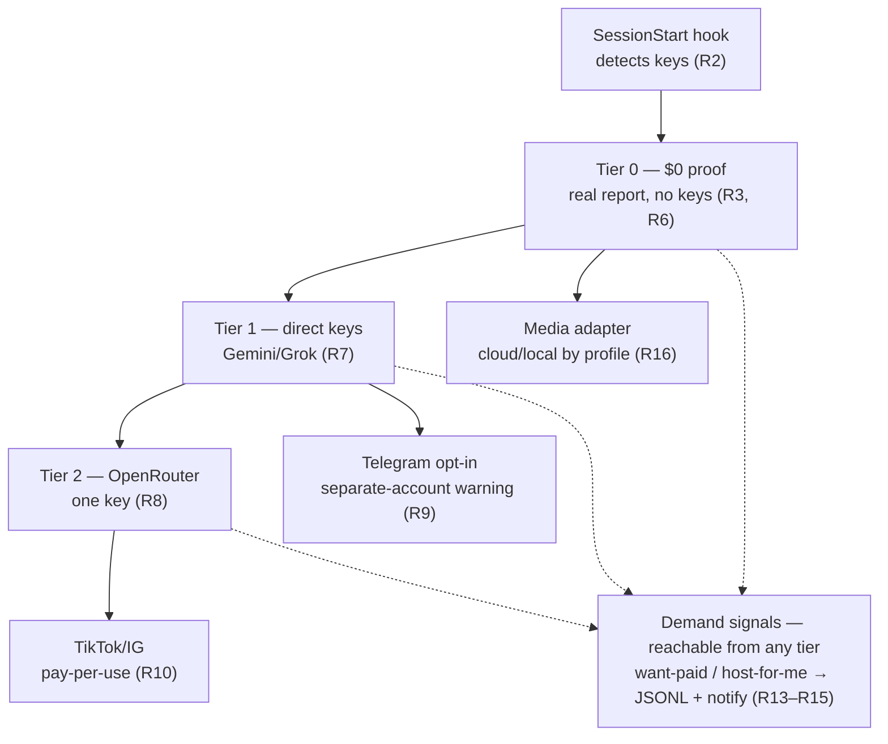

# ZBS Research Onboarding Wizard & Tier Model - Plan

**Target repo:** zbs-research (paths repo-relative). Depth: Deep — phased.

---

## Goal Capsule

- **Objective.** A PostHog-class onboarding wizard for the ZBS Research skill: install → first deep, multi-source, reaction-weighted report with the minimum possible connections (ideally zero), a progressive path to unlock depth, and built-in demand signals that measure willingness to pay before anything paid is built.
- **Product authority.** Nikita. The wizard runs inside the Claude Code agent (the conversation is the wizard) — no separate binary. Free skill under the ZBS brand is the funnel; the paid hypothesis (managed Telegram + done-for-you for CIS niches) is validated by demand signals, not assumed.
- **Scope this run:** full wizard, all tiers (Nik's explicit choice), delivered in 3 phases — Phase A (wizard + Tier-0 + demand signals = first wow) first.
- **Open blockers (tracked, not gating):** Arctic-Shift score fields (load-bearing for Reddit reaction-weighting — U14 migrates the connector and runs the probe); OpenRouter native-tool pass-through (U4 grounding-evidence smoke runs before the routing is built); demand-signal reach for organic installs (v1 measures Nik-configured installs; bundled relay deferred — see KTD3).

---

## Product Contract

Product Contract preservation: R1–R21 carried from the requirements-only version (ce-brainstorm); R22 added (2026-07-17 — market-radar / product-launch source layer, per Nik) with KTD7, U12, U13; R23 added (2026-07-18 — Threads search source, per Nik mid-implementation) with U15. Changed by doc-review (2026-07-17): R2 — detection restated to share the runtime's actual key-resolution path (the brainstorm's fixed order did not match `read_key()` in code); R6/R7 — Meta Ad Library and YouTube re-tiered out of the zero-key floor (both require a token/key in practice; the zero-key promise must be true).

### Primary actor & core outcome

- **Primary:** Nik's client — a lite-technical operator on a Claude-Code-compatible host, wanting deep research without wiring a zoo of services. **Secondary:** Nik (self profile, local $0 Mac); the agent (executes the wizard as dialogue).
- **Core outcome:** in minutes, zero required keys, the client sees a real reaction-weighted report; then chooses, one visible decision at a time, how much depth to unlock — and can signal "I want paid" / "just host it" without any silent account creation.

### Requirements

**Wizard & onboarding flow**

- R1. Wizard **is the conversation** — `AskUserQuestion` modal + prose fallback (Codex/Cursor). No separate installer binary.
- R2. SessionStart hook **detects existing state** (keys/accounts) using the exact resolution the runtime uses (`read_key()`: `DEEP_RESEARCH_SECRETS_DIR` files → process env). Any additional lookup legs (project/global config, OS keychain) land in `read_key()` itself so detection always matches runtime; OS keychain is deferred from v1. Ask only for what's missing.
- R3. **Proof before ask:** run $0 Tier-0 and show a real result before prompting for any paid key.
- R4. Welcome pitch **inside the first wizard question**, never a standalone message (last30days #750).
- R5. Each setup path ends with a **verification step that proves it works**; a `--diagnose`/doctor self-report shows state with no network call.

**Source tiers**

- R6. **Tier 0 — zero keys:** HN, Reddit (Arctic-Shift), GitHub, Polymarket. Default floor. Meta Ad Library is free but token-gated (same class as Product Hunt in KTD7) — included in the default set only when a token is detected.
- R7. **Tier 1 — own direct keys:** Gemini / Grok native grounded lenses. Independent blast-radius. YouTube coverage arrives at this tier via Gemini googleSearch grounding (no zero-key YouTube source exists or is planned).
- R8. **Tier 2 — one OpenRouter key** routes all lenses. Explicit provider-native tools (not `:online`), raw HTTP, Perplexity smoke-tested.
- R9. **Telegram** (moat): guide Telethon install, parse on client's behalf. Hard warning: **separate/secondary account, never personal.** Explicit opt-in.
- R10. **TikTok / Instagram** — optional, **pay-per-use** adapter (Apify or ScrapeCreators). Off by default.
- R11. **GitHub issues + comments** as a first-class scored source.
- R12. **LinkedIn de-prioritized** — not default (mostly reposts).
- R23. **Threads source** (added 2026-07-18, per Nik): search Meta Threads posts as a discourse source. Research-verified reality (2026): no zero-key search exists — official `keyword_search` is free but token-gated (`THREADS_ACCESS_TOKEN`; Standard Access covers own posts only, public search needs Advanced Access App Review; 2,200 q/24h; no engagement counts on results); ScrapeCreators `/v1/threads/search` is the pay-per-use path with engagement counts (existing `scrapecreators` key). Free-first: official token preferred, vendor opt-in; no ToS-hostile scraping.
- R22. **Market-radar source layer** — a distinct source class (not discourse): *launch-radar* (what's shipping: Product Hunt, Show HN, yc-oss, DevHunt, MicroLaunch) + *revenue/exit-radar* (what's selling/sold: Flippa, Substack leaderboards, Whop Trends, Gumtrends). Ranked by **launch-momentum + category-velocity**, not raw votes. Free-first (Show HN already covered, yc-oss/Flippa-sold/Substack/PH-token/DevHunt); revenue datasets opt-in pay-per-use. Skips gameable AI-directories (TAAFT/Futurepedia). AI-consulting has no good launch source — explicit gap.

**Demand signals**

- R13. Explicit **"I want the paid version"** action — never silent auto-mint (last30days #524).
- R14. Explicit **"just host it for me"** (managed) action — separate named signal.
- R15. Both signals **recorded so Nik can measure willingness to pay.** v1 = measurement, not fulfillment.

**Deployment & differentiation**

- R16. **Two deployment profiles** by config: self (local $0 Mac) vs client (cloud-cheap). Media backend pluggable.
- R17. **Budget invariant:** no Anthropic/OpenAI API by default; synthesis in client's session; OpenAI opt-in.
- R18. **Runs on Windows out of the box** (last30days ~30 broken issues); stdlib + threading, verified-green.
- R19. **Clean security posture** (last30days #565 High-Risk blocks clients): least-privilege + transparent "what it does / sends where".
- R20. **Install doesn't fail** — passes `claude plugin validate`, correct `skills/<name>/SKILL.md` layout.
- R21. **Smarter ranking than vote-count-only** (last30days #641): comment-evidence + relevance floor + anti-bot.

### Scope boundaries

**In scope (v1)**

- Full conversational wizard (R1–R5)
- All tiers (R6–R12)
- Demand signals + recording (R13–R15)
- Two profiles (R16–R17)
- Differentiation fixes (R18–R21)
- Market-radar layer (R22)

**Non-goals / Deferred to Follow-Up Work**

- Actual managed hosting backend — signal button only
- Real payment/billing
- Non-coder GUI/dashboard wrapper
- LinkedIn connector
- In-product done-for-you fulfillment (Nik's consulting, off-tool)
- Gameable AI-directories (TAAFT/Futurepedia) — redundant with PH, worse freshness
- AI-consulting market-radar — no good launch source exists (services market); explicit gap, not an oversight
- Bundled notify relay for organic installs — v1 demand measurement covers Nik-configured installs; organic installs record signals locally (see KTD3)

---

## Planning Contract

Key Technical Decisions:

- KTD1. **Wizard = SKILL.md conversation + SessionStart hook, not a binary.** Unlike PostHog's `npx` agent, we're already inside the agent. The hook emits detected-state JSON to stdout (surfaced to the agent as context); the SKILL.md drives steps via `AskUserQuestion` with a prose fallback. Cheaper, no install step, host-portable.
- KTD2. **OpenRouter via raw HTTP with explicit provider-native tools** (`googleSearch` for Gemini, `x_search` for Grok, Sonar models for Perplexity) — NOT the `:online` shortcut (forces search every call, dumber+pricier). Our existing raw-`urllib` channels are the safe path (wrapper libs have grounding bugs). One `OPENROUTER_API_KEY` selects OpenRouter base-URL + per-provider tool schema; direct keys remain the independent-blast-radius alternative. Pass-through of provider-native tools is unverified — the U4 grounding-evidence smoke runs before the routing is built; fallback if googleSearch/x_search do not pass through: Tier 2 routes Perplexity-Sonar only, Gemini/Grok stay direct-key Tier 1.
- KTD3. **Demand signal → append-only JSONL locally, always; notify to Nik's Telegram only when a notify target is configured.** Explicit opt-in, never auto-mint (last30days #524). v1 records the press + timestamp + which tier context. No credential capable of acting as Nik's bot is ever shipped inside the public skill — the notify target is configured per install (Nik sets it when he provisions a client). The "Nik was notified" confirmation is shown only when the notify send actually succeeded; otherwise honest copy: "recorded locally". v1 measurement scope = Nik-configured installs; organic installs record locally (bundled relay endpoint deferred — see Scope boundaries). No payment, no hosting.
- KTD4. **Telegram via Telethon on a client-supplied session** from a **separate/secondary account**. A hard warning gate (must be acknowledged) precedes any session capture; the wizard never proceeds without it. The session file is a live credential: it is stored under `DEEP_RESEARCH_SECRETS_DIR` with 0600 permissions (same convention as key files), never inside the project/output tree. Parsing is read-only; channel discovery uses `getChannelRecommendations` (subscriber-overlap) + forward-graph (from ideation).
- KTD5. **Media backend = pluggable interface** chosen by `DEEP_RESEARCH_PROFILE`. *client* (default): cloud — Groq Whisper ($0.04/hr) + Gemini Flash vision (sub-cent). *self*: local MLX Whisper + Gemma-3 vision ($0, Mac-bound). Connectors return bytes+metadata; the adapter transcribes.
- KTD6. **New sources extend the existing registry pattern** (`Connector(name, kind, fn, desc, requires)` + `channel_*` + `OUTPUT_NAMES`), not a rewrite. Keys reuse `read_key()`/`KEYS` with `DEEP_RESEARCH_SECRETS_DIR`; `scrapecreators`/`brave` key hooks already exist. Graceful `ERROR.md` degrade is inherited.
- KTD7. **Market-radar ranks by launch-momentum + category-velocity, not raw votes.** launch-radar score = upvotes × recency-decay × maker-engagement; category-velocity = count of similar launches in a window (the "how saturated is this niche" signal). revenue/exit-radar ranks by realized revenue/multiple directly (Flippa sold-price, Substack ARR-rank, Whop revenue). **Free-first tiering:** Show HN (existing HN connector + `show_hn` filter), yc-oss/api (free JSON), Flippa sold-pages + API, Substack leaderboards, DevHunt (GitHub API) = Tier 0; Product Hunt = free read but OAuth token (Tier 1); Whop Trends ($99 — its REST API wrapped as a direct connector by default; adopting its MCP server instead requires an explicit trust review of what it can observe/invoke inside the client session), Gumtrends, Toolify-scrape = opt-in pay-per-use. Verify snippet-sourced prices/endpoints live before building.

---

## High-Level Technical Design

The wizard gates each tier behind one visible decision, always showing what's already unlocked free before pitching the next. Tier-0 proof runs before any key ask (R3). Demand signals are reachable from any tier.



---

## Output Structure

New/changed files. Tree is a scope declaration, not a constraint — per-unit Files lists are authoritative. Connectors may stay inline in `deep-research.py` if a separate `connectors/` package proves heavier than the registry pattern warrants (implementer's call).

```text
hooks/
└── hooks.json                  # NEW — plugin-root SessionStart → detect_state.py
                                #   (command uses ${CLAUDE_PLUGIN_ROOT}); plugin hooks are
                                #   discovered at plugin root, not inside skills/
.claude-plugin/plugin.json      # declare hooks path here if root default is not picked up
CONFIGURATION.md                # + security/transparency section (R19)
README.md                       # + Windows + "what it sends where" (R18, R19)
skills/deep-research/
├── SKILL.md                    # + wizard STEP flow, tier gates, Telegram warning
├── scripts/
│   ├── deep-research.py        # + connectors (telegram, tiktok_ig, meta_ads, github_issues),
│   │                           #   Arctic-Shift Reddit rewrite, OpenRouter backend,
│   │                           #   demand-signal mode, --diagnose
│   ├── detect_state.py         # NEW — key/account/onboarding detection, emits JSON (R2)
│   ├── media_backend.py        # NEW — pluggable transcription/vision (R16, KTD5)
│   ├── signals.py              # NEW — demand-signal JSONL + optional notify (R13-15)
│   ├── connectors/             # NEW dir — telegram.py, tiktok_ig.py, meta_ads.py,
│   │                           #   launch_radar.py, revenue_radar.py
│   └── selftest.sh             # + Windows-safe, $0-path, wizard-dry-run, validate checks
└── tests/                      # existing selftest discovery root (unittest discover -s here)
    ├── test_detect_state.py    # NEW
    ├── test_signals.py         # NEW
    ├── test_media_backend.py   # NEW
    ├── test_ranking.py         # NEW
    ├── test_openrouter_routing.py  # NEW
    ├── test_github_issues.py   # NEW
    ├── test_telegram.py        # NEW
    ├── test_tiktok_ig.py       # NEW
    ├── test_meta_ads.py        # NEW
    ├── test_launch_radar.py    # NEW
    ├── test_revenue_radar.py   # NEW
    └── test_reddit_arctic_shift.py  # NEW
```

---

## Implementation Units

Grouped in 3 phases. Phase A first (wizard + Tier-0 + demand = first wow and the demand sensor). U-IDs stable.

| U-ID | Title | Key files | Depends on |
|---|---|---|---|
| U1 | SessionStart hook + state detection | `hooks/hooks.json`, `skills/deep-research/scripts/detect_state.py` | — |
| U2 | Wizard flow in SKILL.md | `skills/deep-research/SKILL.md` | U1 |
| U3 | Demand-signal capture | `skills/deep-research/scripts/signals.py` | — |
| U4 | OpenRouter backend (Tier 2) | `skills/deep-research/scripts/deep-research.py` | — |
| U5 | GitHub issues + comments source | `skills/deep-research/scripts/deep-research.py` | — |
| U6 | Telegram connector + warning gate | `skills/deep-research/scripts/connectors/telegram.py` | U2 |
| U7 | TikTok / Instagram connector | `skills/deep-research/scripts/connectors/tiktok_ig.py` | U9 (soft) |
| U12 | Launch-radar connectors | `skills/deep-research/scripts/connectors/launch_radar.py` | U10 (soft) |
| U13 | Revenue/exit-radar connectors | `skills/deep-research/scripts/connectors/revenue_radar.py` | — |
| U14 | Reddit → Arctic-Shift migration | `skills/deep-research/scripts/deep-research.py` | U10 (soft) |
| U15 | Threads connector (token/vendor) | `skills/deep-research/scripts/connectors/threads.py` | U10 (soft) |
| U8 | Meta Ad Library connector | `skills/deep-research/scripts/connectors/meta_ads.py` | — |
| U9 | Pluggable media backend | `skills/deep-research/scripts/media_backend.py` | — |
| U10 | Ranking upgrade | `skills/deep-research/scripts/deep-research.py` | — |
| U11 | Differentiation hardening | `skills/deep-research/scripts/selftest.sh`, `CONFIGURATION.md`, `README.md` | U1–U10, U12–U14 |

**Phase A — Wizard core, Tier-0 proof, demand sensor**

### U1. SessionStart hook + state detection

- **Goal:** On session start, detect which keys/accounts are present and whether onboarding already ran, and surface that to the agent so the wizard asks only for what's missing.
- **Requirements:** R2, R5
- **Dependencies:** none
- **Files:** `hooks/hooks.json` (new, plugin root), `.claude-plugin/plugin.json` (declare hooks path if the root default is not picked up), `skills/deep-research/scripts/detect_state.py` (new), `skills/deep-research/scripts/deep-research.py` (`--diagnose` mode), `skills/deep-research/tests/test_detect_state.py` (new)
- **Approach:** Detection shares the runtime's actual resolution — call the same `read_key()`/`KEYS` logic (`DEEP_RESEARCH_SECRETS_DIR` files → env; no keychain today; any new lookup legs land in `read_key()` itself so detection never diverges from runtime). `detect_state.py` prints JSON: which of {gemini, grok, perplexity, openrouter, scrapecreators, groq, telegram-session} are configured, plus profile, plus onboarding state (`wizard_done` + chosen tier from a project-local config written at wizard exit). Values are booleans/names only — never key material or prefixes (mirrors `list_connectors_json()`'s missing_keys shape). `hooks.json` lives at the plugin root (plugin hooks are discovered there, not inside `skills/`); its SessionStart command invokes `${CLAUDE_PLUGIN_ROOT}/skills/deep-research/scripts/detect_state.py`; stdout becomes agent context. `--diagnose` (R5) renders the same JSON as a human-readable doctor report, no network call.
- **Patterns:** Existing `read_key`/`KEYS` in `skills/deep-research/scripts/deep-research.py` (key lookup block); existing `--list-connectors` JSON shape.
- **Test scenarios:** Happy: no keys → all false + profile=client + wizard_done=false. Env key present → that provider true. `DEEP_RESEARCH_SECRETS_DIR` override respected. Onboarding marker present → wizard_done=true with tier. `--diagnose` produces the doctor report offline. Edge: malformed key file → treated absent, no crash. Assert output contains no key values or prefixes. Windows: no POSIX-only calls (Covers R18 at unit level).
- **Verification:** `python3 detect_state.py` emits valid JSON on macOS + Windows; the hook fires on session start from the plugin root; `--diagnose` works with zero network.

### U2. Wizard flow in SKILL.md (conversation-as-wizard)

- **Goal:** Drive onboarding as dialogue: welcome-inside-first-question, $0 proof before any key ask, one visible decision per tier, verification step.
- **Requirements:** R1, R3, R4, R5
- **Dependencies:** U1
- **Files:** `skills/deep-research/SKILL.md` (add STEP flow section)
- **Approach:** Add an "Onboarding (first run)" section: STEP 0 read detected state (U1) — if no hook-injected context is present (non-Claude-Code hosts: Codex/Cursor), run `python3 detect_state.py` directly and parse its JSON, so detection is host-portable, not just the dialogue → STEP 1 first `AskUserQuestion` with welcome embedded (Auto/Manual/Skip), gated on the onboarding marker: when `wizard_done` is set, skip the pitch entirely → STEP 2 run Tier-0 `--only` free connectors, show brief → STEP 3 offer tier upgrades one at a time, showing what's already free → STEP 4 verification (a real segment) + `--diagnose`; write the onboarding marker at wizard exit. Prose fallback block for non-modal hosts.
- **Execution note:** Documentation/behavior unit — verify by a scripted dry-run of the wizard steps against the free path, not unit tests.
- **Patterns:** last30days modal-vs-prose dual flow; #750 (welcome inside first question).
- **Test scenarios:** Test expectation: none — SKILL.md prose. The selftest wizard-dry-run asserts only what a script can check: the Tier-0 connector set runs with zero keys and a brief renders. The report-before-paid-prompt ordering is verified via a manual scripted-conversation checklist recorded here.
- **Verification:** A no-key session reaches a real Tier-0 brief before any paid-key prompt appears (scripted-conversation checklist); a second session with `wizard_done` set gets no repeat pitch.

### U3. Demand-signal capture

- **Goal:** Record explicit "want paid" / "just host it" presses so Nik can measure willingness to pay; never auto-mint.
- **Requirements:** R13, R14, R15
- **Dependencies:** none (wired into wizard at U2)
- **Files:** `skills/deep-research/scripts/signals.py` (new), `skills/deep-research/tests/test_signals.py` (new); `skills/deep-research/scripts/deep-research.py` add `--signal <kind>` mode
- **Approach:** Append-only JSONL (`{ts, kind, tier_context, profile}`) under the run/project dir; notify to Nik's Telegram only when a notify target is configured per install (KTD3 — no bot credential is ever shipped inside the skill). Kinds: `want-paid`, `host-for-me`. "host-for-me" shows "Nik was notified" only when the notify send actually succeeded; without a configured target (or on send failure) the copy is honest: "recorded locally". Explicit invocation only.
- **Patterns:** manifest.json writing in `skills/deep-research/scripts/deep-research.py` and the atomic claim-file write in `skills/deep-research/scripts/output_paths.py`; graceful degrade if notify target absent.
- **Test scenarios:** Happy: `--signal want-paid` appends one JSONL line with timestamp+kind. host-for-me with configured target + successful send → "notified" confirmation. Edge: no notify target → still logs locally, copy says "recorded locally", never claims Nik was notified. Error: unwritable dir → surfaces error, doesn't lose the signal silently; notify send failure → local log intact, honest copy. No network call unless notify configured.
- **Verification:** Both signal kinds append correctly; local log works with zero configuration.

**Phase B — Source tiers**

### U4. OpenRouter backend (Tier 2)

- **Goal:** One `OPENROUTER_API_KEY` routes gemini/grok/perplexity lenses through OpenRouter with explicit native tools.
- **Requirements:** R8
- **Dependencies:** none
- **Files:** `skills/deep-research/scripts/deep-research.py` (channel_gemini/grok/perplexity + base-URL routing + connector `requires` semantics), `skills/deep-research/tests/test_openrouter_routing.py` (new)
- **Approach:** Add `openrouter` key to `KEYS`. When present and a channel lacks its direct key, route via OpenRouter base-URL with the provider's **explicit native tool schema** (googleSearch / x_search / Sonar model id) over raw HTTP — never `:online`. Direct keys take precedence (independent blast-radius). Gemini JSON-output vs grounding exclusivity handled (prefer grounding, parse text). Connector availability must treat the openrouter key as satisfying an LLM channel's `requires` (direct key OR openrouter) — touches `missing_keys()`/selection in the registry; only when both are absent is the channel skipped.
- **Execution note:** Run the live smokes BEFORE building the routing layer, and assert grounding evidence per provider (grounding metadata / citations / a current-events answer) — a 200 with the tool field silently dropped must fail the smoke. Perplexity-Sonar reachability has flip-flopped; record results. Fallback per KTD2 if native tools don't pass through.
- **Patterns:** Existing `post_json`/raw-urllib channels; `OPENAI_BASE_URL` override pattern in `skills/deep-research/scripts/deep-research.py`.
- **Test scenarios:** Happy: openrouter key set, no direct gemini key → channel builds OpenRouter request with native googleSearch tool (assert request shape, mocked). Direct key present → uses direct (precedence). Edge: neither key → channel skipped, recorded in manifest. Error: OpenRouter 5xx → ERROR.md, siblings continue. Assert no `:online` suffix ever emitted.
- **Verification:** Request-shape tests pass; one live smoke-test per provider documented.

### U5. GitHub issues + comments as first-class source

- **Goal:** Score GitHub issues + their comments as a research source (product/competitor intel), beyond repo search.
- **Requirements:** R11
- **Dependencies:** none
- **Files:** `skills/deep-research/scripts/deep-research.py` (new `channel_github_issues` + registry + OUTPUT_NAMES), `skills/deep-research/tests/test_github_issues.py` (new)
- **Approach:** New `github-issues` direct connector: given a repo or topic, pull top issues by reactions/comments + comment bodies (GitHub search+issues API via `gh` if present, else unauthenticated). Zero-config (Tier 0). Mirrors the teardown pattern already done manually this session.
- **Patterns:** Existing `channel_github` (repo search) + `gh`-preferred/API-fallback shape.
- **Test scenarios:** Happy: topic → issues ranked by reactions with comment excerpts. Edge: repo with 0 issues → honest empty. Error: rate-limited unauthenticated → ERROR.md degrade. Windows: no POSIX-only calls.
- **Verification:** Returns issue+comment markdown for a known repo; degrades cleanly without `gh`.

### U6. Telegram connector + separate-account warning

- **Goal:** Parse Telegram channels+comments (the moat) via a client-supplied Telethon session, gated behind a hard separate-account warning.
- **Requirements:** R9
- **Dependencies:** U2 (wizard gate)
- **Files:** `skills/deep-research/scripts/connectors/telegram.py` (new), `skills/deep-research/scripts/deep-research.py` (register), `skills/deep-research/SKILL.md` (warning gate copy), `skills/deep-research/tests/test_telegram.py` (new)
- **Approach:** Optional dependency (Telethon); connector no-ops with a clear message if absent. Read-only channel/message/comment pull; channel discovery via `getChannelRecommendations` + forward-graph (ideation). Wizard STEP shows the hard warning (separate/secondary account, ban + personal-DM risk) and requires explicit acknowledgement before any session is used. Session file storage per KTD4: under `DEEP_RESEARCH_SECRETS_DIR` with 0600 permissions, never inside the project/output tree (Telethon's default writes `<name>.session` to the process cwd — override it explicitly).
- **Execution note:** Do not bundle Telethon as a hard dep (keeps Tier-0 install light + security posture clean, R19); import lazily.
- **Patterns:** Existing direct-connector shape; ideation dual-edge-graph design (docs/ideation).
- **Test scenarios:** Happy: with a mock session, returns channel posts+comments with reactions. Gate: connector refuses to run unless the acknowledgement flag is set. Storage: session path resolves under `DEEP_RESEARCH_SECRETS_DIR`, never inside the project/output tree. Edge: Telethon not installed → clear no-op message, not a crash. Error: auth failure → ERROR.md. No personal-account default anywhere.
- **Verification:** Warning gate blocks unacknowledged runs; connector degrades cleanly without Telethon.

### U7. TikTok / Instagram connector (pay-per-use)

- **Goal:** Optional TikTok/IG source via a pay-per-use vendor for clients who don't want flaky OSS scrapers.
- **Requirements:** R10
- **Dependencies:** U9 (media adapter for transcripts) — soft; can ship metadata-only first
- **Files:** `skills/deep-research/scripts/connectors/tiktok_ig.py` (new), `skills/deep-research/scripts/deep-research.py` (register), `skills/deep-research/tests/test_tiktok_ig.py` (new)
- **Approach:** Vendor adapter selectable by config: `scrapecreators` (key hook already exists) or Apify. Off by default. Pulls posts + comments + engagement; transcripts routed through the media adapter (U9) or the vendor's transcript endpoint. Honest cost note surfaced.
- **Patterns:** Existing `scrapecreators`/`brave` key hooks in `KEYS`; direct-connector shape.
- **Test scenarios:** Happy: vendor key set → posts+comments+engagement (mocked). Off by default: no key → skipped, recorded. Edge: vendor 402/quota → ERROR.md with cost hint. Assert not in the default connector set.
- **Verification:** Runs only when explicitly enabled + keyed; default runs never touch it.

### U12. Launch-radar connectors (market-radar: what's shipping)

- **Goal:** Surface what's launching now, ranked by launch-momentum + category-velocity — a leading market signal discourse can't give.
- **Requirements:** R22
- **Dependencies:** U10 (soft — only for the shared scoring plumbing: recency-decay / bounded-engagement helpers; launch-momentum itself is U12's own formula per KTD7, not a U10 mode)
- **Files:** `skills/deep-research/scripts/connectors/launch_radar.py` (new), `skills/deep-research/scripts/deep-research.py` (register + OUTPUT_NAMES), `skills/deep-research/tests/test_launch_radar.py` (new)
- **Approach:** Free-first sub-sources: **Product Hunt** GraphQL v2 (free read, `PRODUCTHUNT_TOKEN` — Tier 1), **Show HN** (extend existing HN Algolia connector with `show_hn` tag — Tier 0, no new key), **yc-oss/api** (free JSON), **DevHunt** (listings as GitHub PRs → GitHub API), **MicroLaunch** (scrape, best-effort). Compute launch-momentum (upvotes × recency-decay × maker-engagement) and category-velocity (count of similar launches in window). Opt-in **Toolify** traffic-rank (scrape) for sustained-usage signal.
- **Execution note:** Verify PH free-read token scope + Show HN filter live before building; snippet-sourced.
- **Patterns:** Existing HN Algolia connector (Show HN is a filter on it); direct-connector registry shape; U10 ranking helper.
- **Test scenarios:** Happy: topic → launches with momentum score + category-velocity count (PH mocked, yc-oss parsed). Show HN: `show_hn` filter returns product posts. Edge: PH token absent → Show HN/yc-oss still work (Tier-0 degrade). Error: MicroLaunch scrape fails → ERROR.md, siblings continue. Velocity: N similar launches counted correctly on a fixture.
- **Verification:** Returns ranked launches with zero keys (Show HN + yc-oss); PH enriches when token present.

### U13. Revenue/exit-radar connectors (market-radar: what's selling/sold)

- **Goal:** Surface revenue-verified traction and realized exits — the "proven value" signal (not launch-day hype) for hypothesis-validation and infoproducts.
- **Requirements:** R22
- **Dependencies:** none
- **Files:** `skills/deep-research/scripts/connectors/revenue_radar.py` (new), `skills/deep-research/scripts/deep-research.py` (register), `skills/deep-research/tests/test_revenue_radar.py` (new)
- **Approach:** Free Tier-0: **Flippa** (documented API + free per-listing sold-price pages — realized exit multiples), **Substack** leaderboards (Rising + Bestsellers, free). Opt-in pay: **Whop Trends** ($99 lifetime — it ships an MCP server; wrap it or call its API), **Gumtrends** (one-time, Gumroad revenue estimates). Ranked by revenue/multiple directly, not votes. Niche map: Flippa→microsaas, Whop→AI-creator-economy, Gumtrends+Substack→infoproducts.
- **Execution note:** Whop default path is a REST-API wrapper as a direct connector; adopting its MCP server instead requires an explicit trust review (what the server can observe/invoke inside the client session) before it is offered to clients (KTD7, R19). Verify $99/one-time pricing live (snippet-sourced).
- **Patterns:** Direct-connector shape; opt-in-key gating like TikTok/IG (U7); Meta-Ads money-signal sibling (U8).
- **Test scenarios:** Happy: Flippa sold-page parsed → price/multiple; Substack leaderboard → ARR-ranked entries. Opt-in gate: Whop/Gumtrends skipped without key/config, recorded. Edge: Flippa rate-limit → ERROR.md. Assert revenue sources rank by revenue, not upvotes.
- **Verification:** Flippa + Substack return revenue/exit data with zero keys; paid sources run only when enabled.

### U14. Reddit connector → Arctic-Shift migration

- **Goal:** Replace the dead `reddit.com/search.json` path with the Arctic-Shift API so Tier-0 Reddit actually returns reaction-weighted posts+comments — the flagship free source the wizard's $0 proof depends on.
- **Requirements:** R6, R21
- **Dependencies:** U10 (soft — ranking helper applied to Reddit results)
- **Files:** `skills/deep-research/scripts/deep-research.py` (rewrite `channel_reddit` onto Arctic-Shift), `skills/deep-research/tests/test_reddit_arctic_shift.py` (new)
- **Approach:** Rewrite `channel_reddit` onto Arctic-Shift's search endpoints (posts + comments), keeping the inherited `ERROR.md` degrade. The load-bearing score-field probe happens HERE, before the Tier-0 proof depends on it (it was previously parked in U11's Phase-C audit — too late). If score fields are absent, implement and document the honest fallback in the connector output.
- **Execution note:** Run the live Arctic-Shift score-field probe first, before rewriting; record the result. Arctic-Shift is community-run — keep the degrade path honest about availability.
- **Patterns:** Existing direct-connector shape and `ERROR.md` degrade; U10 ranking helper.
- **Test scenarios:** Happy: mocked Arctic-Shift response → posts ranked with scores + comment excerpts. Edge: empty result → honest empty. Error: rate-limit/5xx → ERROR.md, siblings continue. Fallback: score fields absent → documented degradation note in output, no crash. Windows: no POSIX-only calls.
- **Verification:** Live score-field probe documented; the Tier-0 dry-run includes real Reddit results via Arctic-Shift.

### U15. Threads connector (token-gated official API / pay-per-use vendor)

- **Goal:** Search Meta Threads posts by keyword as a discourse source — the platform Nik finds high-signal but LLM lenses search poorly.
- **Requirements:** R23
- **Dependencies:** U10 (soft — ranking helper for vendor path with engagement counts)
- **Files:** `skills/deep-research/scripts/connectors/threads.py` (new), `skills/deep-research/scripts/deep-research.py` (KEYS `threads` + register), `skills/deep-research/scripts/detect_state.py` (add threads provider), `skills/deep-research/SKILL.md` (tier copy + output layout), `skills/deep-research/tests/test_threads.py` (new)
- **Approach:** Free-first dual path. Official: `GET graph.threads.net/v1.0/keyword_search` with `THREADS_ACCESS_TOKEN` (q, search_type=TOP|RECENT, since/until as Unix timestamps, limit≤100; no cursor assumptions); results carry no engagement counts — rank by relevance+recency with an honest note; empty results with a valid token get a "Standard Access searches only your own posts — Advanced Access (App Review) unlocks public search" hint. Vendor: ScrapeCreators `/v1/threads/search` (`x-api-key`, existing key; ~10 posts/request WITH engagement counts) — used when the official token is absent, or forced via `DEEP_RESEARCH_THREADS_VENDOR=scrapecreators`; ranked via `rank_items`; honest cost note. Availability: `requires=["threads"]` with `fallback_key="scrapecreators"` (existing OR-semantics from U4). No scraping paths (crawler-UA spoofing is ToS-hostile — research-verified).
- **Execution note:** Endpoint shapes are research-verified against live docs (2026-07-18, adversarial re-fetch). Mocked request-shape tests only; no live token calls in tests.
- **Patterns:** meta_ads.py (token-gated connector), tiktok_ig.py (scrapecreators vendor shape), U4 fallback_key semantics.
- **Test scenarios:** Official path: token set → request to graph.threads.net keyword_search with q/search_type/limit params, results rendered with no-engagement note; empty result + token → Advanced Access hint. Vendor path: no threads token + scrapecreators key → api.scrapecreators.com request with x-api-key, posts ranked by engagement, cost note present. Precedence: both keys → official free path wins; env override forces vendor. Neither key → connector skipped, recorded in manifest. Error: HTTP 429/5xx → ERROR.md, siblings continue. Sensitive-keyword empty array → honest empty. Windows-safe scan.
- **Verification:** Request-shape tests pass; `--list-connectors` shows threads with OR-key semantics; SKILL.md tier copy mentions App Review reality honestly.

**Phase C — Profiles, ranking quality, differentiation hardening**

### U8. Meta Ad Library connector (money signal, free with token)

- **Goal:** Add free ad-spend intelligence (the "money is the reaction" tier from ideation) as a token-gated free source.
- **Requirements:** R6
- **Dependencies:** none
- **Files:** `skills/deep-research/scripts/connectors/meta_ads.py` (new), `skills/deep-research/scripts/deep-research.py` (register), `skills/deep-research/tests/test_meta_ads.py` (new)
- **Approach:** Meta Ad Library API (official, free ~200 calls/hr) — requires a Meta developer app + access token, so it is free-with-token, not zero-key (R6): the wizard includes it in the default set only when detect_state finds a Meta token, with guidance for acquiring one. Default EU scope (full commercial detail is EU-only under DSA; US is bucketed/political). Surfaces advertisers + sustained spend as a distinct source class.
- **Test scenarios:** Happy: query → advertisers with spend buckets. Edge: US scope → honest "bucketed/political only" note. Error: needs App-Review token absent → clear guidance, degrade. Rate-limit → ERROR.md.
- **Verification:** Returns ad data for an EU-scoped query; honest degradation without a token.

### U9. Pluggable media backend (deployment profiles)

- **Goal:** Transcription/vision as a profile-selected backend: cloud-cheap for clients, local $0 for self.
- **Requirements:** R16, R17
- **Dependencies:** none
- **Files:** `skills/deep-research/scripts/media_backend.py` (new), `skills/deep-research/scripts/deep-research.py` (add `groq` to `KEYS`), `skills/deep-research/tests/test_media_backend.py` (new)
- **Approach:** Abstract `transcribe(bytes)` / `describe_image(bytes)`. `DEEP_RESEARCH_PROFILE=client` (default) → Groq Whisper + Gemini Flash vision (raw HTTP, own keys; `groq` added to `KEYS` and to the detect_state provider list). `=self` → local MLX Whisper + Gemma-3 (lazy import, no-op with guidance if unavailable). Neither Anthropic nor OpenAI (R17).
- **Patterns:** Existing raw-urllib `post_json`; KTD5.
- **Test scenarios:** Happy: client profile → cloud request shape (mocked, asserts Groq/Gemini endpoints). self profile → local path attempted, clean guidance if MLX absent. Edge: unknown profile → defaults to client with a warning. Assert no OpenAI/Anthropic endpoints.
- **Verification:** Both profiles resolve the right backend; request-shape tests pass.

### U10. Ranking upgrade — comment-evidence + relevance floor

- **Goal:** Rank beyond raw vote-count: weight comment evidence, apply a relevance floor, penalize bot signatures — fixing last30days #641 on niche topics.
- **Requirements:** R21
- **Dependencies:** none
- **Files:** `skills/deep-research/scripts/deep-research.py` (ranking helper used by direct connectors), `skills/deep-research/tests/test_ranking.py` (new)
- **Approach:** A shared scoring function: relevance floor (topic token overlap must clear a threshold before engagement counts) + bounded engagement bonus + a "too clean" (like-heavy/comment-light) penalty. Applied in direct connectors' sort. Mirrors ideation idea #4.
- **Test scenarios:** Happy: on-topic high-engagement ranks above off-topic viral. Floor: off-topic item with huge votes stays below on-topic. Bot signature: like-heavy/comment-light item penalized. Edge: all-low-relevance → returns best-effort with a note.
- **Verification:** Off-topic viral no longer outranks on-topic on a niche fixture.

### U11. Differentiation hardening — Windows, security, install, Arctic-Shift check

- **Goal:** Make the "why switch from last30days" claims true and verified: Windows-green, clean security, install passes validate.
- **Requirements:** R18, R19, R20
- **Dependencies:** U1–U10, U12–U14 (audits the whole surface, market-radar and Arctic-Shift connectors included)
- **Files:** `skills/deep-research/scripts/selftest.sh` (extend), `CONFIGURATION.md` (security/transparency section), `README.md` (Windows + "what it sends where")
- **Approach:** Audit for POSIX-only calls (no `signal.SIGALRM`/`os.killpg`; threading only) — R18. Add a "what it does / what it sends where / least-privilege" section covering every connector's data flow, the Telegram session storage, and the demand-signal notify path — R19. Ensure `claude plugin validate` passes and layout is correct — R20. Confirm U14's Arctic-Shift score-field probe result is recorded in writing (probe itself lives in U14).
- **Execution note:** Config/packaging + verification unit — prefer runtime/smoke checks (a Windows CI matrix run, a live `validate`) over unit coverage.
- **Test scenarios:** Test expectation: mostly smoke. selftest greps for banned POSIX-only symbols across all new connectors (U12–U14 included); `claude plugin validate` exits 0; secret-scan stays clean.
- **Verification:** selftest green on macOS + a Windows run; validate passes; Arctic-Shift score question resolved in writing (via U14).

---

## Verification Contract

- **Unit tests** for U1, U3, U4, U5, U6, U7, U8, U9, U10, U12, U13, U14, U15 pass (`skills/deep-research/tests/` — the existing selftest `unittest discover` root; repo-root `tests/` is NOT discovered), including request-shape assertions for cloud/OpenRouter (mocked, no live spend).
- **selftest.sh** extended: `--list-connectors` shows new connectors; Tier-0 wizard dry-run produces a brief with zero keys; banned-POSIX grep clean; `claude plugin validate` exits 0; secret-scan clean; brief HTML self-contained.
- **Live smokes (documented, minimal spend, run BEFORE the dependent unit is built):** one OpenRouter call per provider asserting grounding evidence (metadata/citations — a 200 with the tool silently dropped fails the smoke); Arctic-Shift score-field probe (U14); Meta Ad Library EU query (with token); Product Hunt free-read token + Show HN filter; Flippa sold-page + Substack leaderboard (both free).
- **Market-radar (U12/U13):** launch-momentum + category-velocity computed on a fixture; revenue sources rank by revenue not votes; Tier-0 launch/revenue sources work with zero keys.
- **Cross-platform:** selftest green on macOS and on a Windows run (CI matrix or manual).
- **Budget invariant:** a default run makes no Anthropic/OpenAI API calls (assert connector set excludes `openai`).

---

## Definition of Done

- A no-key client session reaches a real Tier-0 report **before** any paid-key prompt (R3) — proven by the wizard dry-run.
- Each tier unlocks behind one explicit decision; a zero-risk user stops at Tier 0 with real value.
- Telegram never runs without the separate-account warning acknowledged (R9).
- Demand signals (want-paid / host-for-me) recorded locally with zero config; notify works when configured; "Nik was notified" copy appears only on actual delivery success (R13–R15).
- `--diagnose` reports key/account/profile/onboarding state offline (R5); a repeat session with `wizard_done` set gets no repeat pitch.
- Windows selftest green; `claude plugin validate` passes; security section present; secret-scan clean (R18–R20).
- Default run bills no Anthropic/OpenAI API (R17); OpenAI stays opt-in.
- Ranking fixture shows on-topic beating off-topic-viral (R21).
- Arctic-Shift score-field assumption confirmed (U14 probe) or its fallback documented; Tier-0 Reddit runs on Arctic-Shift, not the dead `.json` path.
- Market-radar layer live (R22): launch-radar (Show HN + yc-oss zero-key, PH with token) + revenue-radar (Flippa + Substack zero-key) return ranked results; paid sources (Whop/Gumtrends) opt-in only.
- Threads source live (R23): official keyword_search with token (honest no-engagement + Advanced-Access notes) or ScrapeCreators vendor path with engagement ranking; skipped cleanly with neither key.
- Abandoned-attempt code from dead-end approaches is removed before declaring done.
