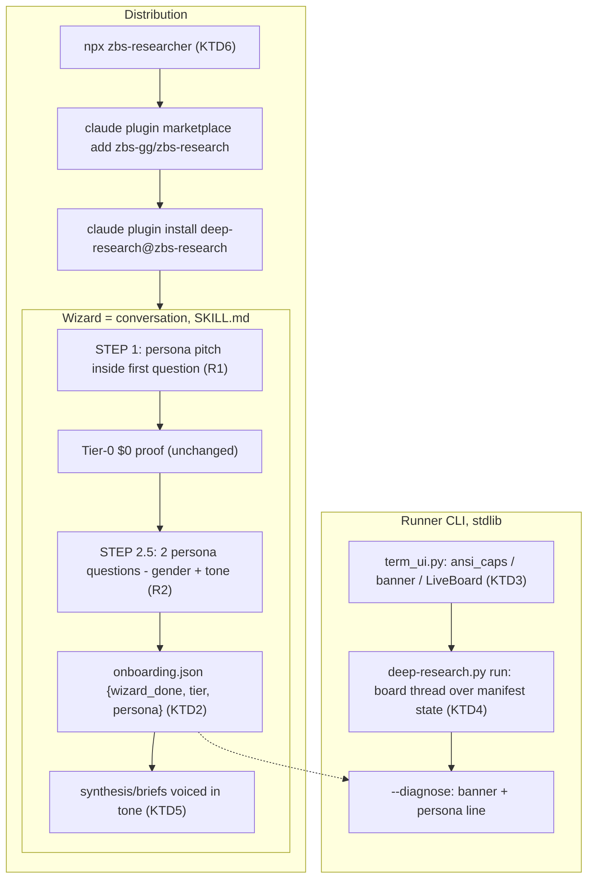

# ZBS Researcher - Persona, CLI Polish, npx Installer, Showcase - Plan

**Target repo:** zbs-research (paths repo-relative). Depth: Standard. Builds ON TOP of the shipped wizard (docs/plans/2026-07-17-002, R1–R23 — all in main); this plan adds the show, not the machinery.

---

## Goal Capsule

- **Objective.** Turn the working wizard into a demo-able product: a named persona (**ZBS Researcher** / «Заебись-Ресёрчер») that introduces itself and asks a couple of delightful questions; ASCII banner + live animated connector progress board in the CLI runner; a PostHog-style `npx zbs-researcher` one-command installer; a README showcase, a demo-video script, and a site brief Nik hands off separately.
- **Product authority.** Nikita. Decisions confirmed this session: name = **ZBS Researcher** (brand-only — plugin id `deep-research` unchanged, zero breakage); npx installer = yes (Nik publishes, I prepare everything); site = brief-only in this repo.
- **Audience.** Nik's clients (lite-technical operators) + the demo video. The wow moment: install one-liner → persona greets you → two questions → $0 real report with an animated progress board.
- **Non-negotiable inherited invariants:** wizard stays a conversation (KTD1 of the origin plan — no separate binary); runner stays stdlib-only + Windows-safe (R18); budget invariant (R17); no repeat pitch when `wizard_done`; selftest markers keep passing.

---

## Product Contract

### Primary actor & core outcome

- **Primary:** Nik's client on a Claude-Code-compatible host; **secondary:** a demo-video viewer deciding in 2 minutes whether this beats "normal researchers".
- **Core outcome:** from `npx zbs-researcher` to a real reaction-weighted report in minutes: the persona introduces itself by name, explains what it can do, asks at most a couple of questions (gender/tone included), and delivers the report — $0, zero keys. **Honest visibility scoping (review-verified):** the animated board renders only in a real TTY — the agent-mediated wizard path captures stderr (not a TTY) and shows today's plain per-channel lines by design; the animation's home surfaces are (a) the npx installer moment (guaranteed live terminal), (b) a direct-terminal run the wizard OFFERS the user as a copyable command ("хочешь посмотреть на прогон вживую — запусти это в терминале"), and (c) the demo video's direct-CLI shot.

### Requirements

**Persona**

- R1. **Self-presentation opens onboarding.** STEP 1's first question embeds the persona pitch: "Привет — я **ZBS Researcher** («Заебись-Ресёрчер»). Умею: [краткий список каналов/уровней]. Могу быть настроен под тебя." English copy for EN users. Still ONE question with Auto/Manual/Skip as the decision (origin R4 preserved — no standalone welcome).
- R2. **At most two persona questions** — PostHog principle "ask only what can't be inferred": (a) gender of address (он/она/нейтрально — affects Russian verb forms of the persona's voice), (b) tone preset («деловой» / «zbs» / «нейтральный», with a one-line sample of each; «свой» via free text). Both skippable with sensible defaults (neutral, деловой). Asked AFTER the Tier-0 proof decision, never blocking the $0 run.
- R3. **Persona persists and colors output.** Choice saved in the existing `onboarding.json` marker (`persona: {gender, tone}`); `detect_state`/`--diagnose` surface it; SKILL.md instructs the agent to write synthesis/briefs in the chosen tone and voice the persona consistently. Tone changes intonation and sign-off only — never facts, structure, or honesty notes. **The profanity floor («без мата в клиентских отчётах by default») binds ALL tone values — presets AND free-text «свой»** — unless the user explicitly lifts it. **Changing persona later:** the user just says so in chat — the agent edits the `persona` object in the marker directly; no wizard re-run, `wizard_done` untouched.

**CLI polish (runner)**

- R4. **ASCII banner.** A ZBS RESEARCHER figlet-style banner (with «заебись-ресёрчер» subtitle) printed by the runner at run start and by `--diagnose`; plain-text fallback when ANSI unsupported. Banner is stderr, never pollutes stdout artifacts.
- R5. **Live progress board.** During a run, connectors render as a live multi-line board: spinner + per-channel status (running/OK n items/ERROR/skip) + elapsed, finishing with a summary line. Implemented with ANSI cursor-up rewrites; degrades to the EXACT current plain `[name] OK 1.2s` lines when not a TTY, `NO_COLOR` set (present and non-empty — per no-color.org; `NO_COLOR=""` counts as absent), `CI` set, or `TERM=dumb`. **`FORCE_COLOR` upgrades SGR color ONLY — the animated board additionally requires a real `stderr.isatty()`, always** (a piped run with FORCE_COLOR must never receive cursor-control frames); `NO_COLOR`/`TERM=dumb` beat `FORCE_COLOR`. The post-run `All channels done. Output: …` footer + file listing print verbatim in EVERY tier (they are the user's only pointer to artifacts).
- R6. **Windows-safe animation.** Pure stdlib: enable VT on Windows via `ctypes` `SetConsoleMode` (Microsoft-documented path; Windows Terminal/ConPTY already defaults VT on); Braille spinner only when confidently modern (`WT_SESSION` or non-Windows), ASCII `|/-\` fallback otherwise; visible-width (SGR-stripped) clamping against `shutil.get_terminal_size()` re-read each frame. No colorama/rich — R18 stays intact.

**Distribution & showcase**

- R7. **npx installer.** npm package `zbs-researcher` (name verified free on the registry, 2026-07-21): the installer detects the `claude` CLI (`where`/`which`), runs `claude plugin marketplace add zbs-gg/zbs-research` + `claude plugin install deep-research@zbs-research`, prints the banner + "open Claude Code and say: запусти deep research". **Flag clarity (review-caught):** in `npx -y zbs-researcher@latest` the `-y` belongs to npx, NOT to cli.js — the docs' default one-liner is the interactive form (cli.js confirms before running commands; the demo plans this beat); the fully non-interactive form is `npx -y zbs-researcher@latest --yes`. cli.js on non-TTY stdin without `--yes` prints the two commands and exits 0 — never hangs on EOF. **Marketplace-name precondition:** `.claude-plugin/marketplace.json` currently declares `name: "deep-research-skill"`, so `deep-research@zbs-research` would NOT resolve — U6 renames the marketplace to `zbs-research` (migration note for the old name) and the command pair is verified live before the installer copy freezes. No dependencies, `engines.node >= 18`; a TTY-gated ASCII spinner runs while the claude commands execute (the npx moment is the client's one guaranteed live terminal — it carries part of the show). If `claude` is missing → prints the two commands + install link, exit 0. Publication is Nik's action (needs his npm login); everything else ready including the exact publish command.
- R8. **README showcase.** Top of README: banner, "минуты до первого отчёта, $0, ноль ключей", install one-liner (npx + native fallback), a "нет node? →" pointer (nodejs.org LTS or the native two-liner that needs no node — the audience is lite-technical), tier table, honest "what it sends where" pointer. GIF/screenshot placeholders with capture instructions (the board GIF comes from a DIRECT terminal run, not an agent session).
- R9. **Demo-video script.** `docs/demo-script.md`: a 2–3 minute shot list — install, persona hello, two answers, animated run on a real topic, the brief, tier upsell glance. With exact commands and the "некоторые из этого строят целые компании" framing Nik wants.
- R10. **Site brief.** `docs/site-brief.md` — positioning, audience (CIS niches / Nik's clients), landing structure, RU/EN copy blocks, CTAs, asset list. Hand-off document for a separate site effort; no site built here.

**Compatibility**

- R11. **Nothing breaks.** Plugin id/paths unchanged; old `onboarding.json` without `persona` reads fine (defaults apply); selftest stays green with version pins updated coherently (plugin 0.2.0 → 0.3.0 across plugin.json, marketplace.json, CHANGELOG, selftest pin); `wizard_done` skip behavior untouched; plain (non-TTY) runner output stays byte-compatible with today's format.

### Scope boundaries

**In scope (v1):** R1–R11.

**Non-goals / Deferred to Follow-Up Work**

- Full plugin rename to `researcher` (breaking; Nik chose brand-only)
- Building the actual site (brief only — Nik sends it to work separately)
- Publishing to npm (prepared here, executed by Nik — needs his npm account)
- Recording the demo video itself (script only; recording is Nik's session, я помогу отдельно)
- Ink/clack-style rich TUI in the wizard itself — the wizard is a conversation inside the agent (origin KTD1); animations live only in the runner CLI
- Voice/TTS persona, avatars — out of v1 identity

---

## Planning Contract

Key Technical Decisions:

- KTD1. **Brand-only naming.** Plugin id, paths, and skill name stay `deep-research`; "ZBS Researcher" lives in copy: SKILL.md persona section, banner, README, installer output, site brief. Zero migration cost, existing installs unaffected. (Full rename rejected by Nik this session.)
- KTD2. **Persona rides the existing marker.** `onboarding.json` gains an optional `persona` object `{gender: "m"|"f"|"neutral", tone: "business"|"zbs"|"neutral"|<free text>}`. `detect_state.collect_state()` surfaces it (absent → defaults, no crash — same tolerant parsing as `wizard_done`). No new files, no new env.
- KTD3. **One terminal-UI module, three capability tiers.** New `term_ui.py` (stdlib-only sibling of the runner): `ansi_caps()` decides {full-unicode | ansi-ascii | plain} from: stderr `isatty()`, `NO_COLOR` (present-and-non-empty per no-color.org), `FORCE_COLOR` (color only — never enables animation without a real TTY), `CI`, `TERM=dumb`, Windows VT enablement via `ctypes.windll.kernel32.SetConsoleMode` (GetConsoleMode | ENABLE_VIRTUAL_TERMINAL_PROCESSING; Microsoft-documented), `WT_SESSION` for unicode confidence. Precedence pinned by tests: `NO_COLOR`/`TERM=dumb` > `FORCE_COLOR` > `CI` > isatty. Exposes `banner()` and `LiveBoard`:
  - **Size from the fd it writes to:** honor `COLUMNS`/`LINES` if set, else `os.get_terminal_size(sys.stderr.fileno())` in try/except with (80,24) fallback — `shutil.get_terminal_size()` reads stdout's fd, which is piped in half our cases (review-caught wrong-fd bug).
  - **Width AND height clamps, re-read every frame:** rows clamp to `lines - 1`; when the channel set overflows, in-flight rows render individually and finished/skipped collapse into one `+N done/skipped` aggregate line (17 connectors vs a 24-row pane must not corrupt frames).
  - **Sanitization is a security boundary:** ALL control/escape sequences (not just SGR) are stripped from any interpolated text (topic, channel error strings — third-party HTTP bytes reach `str(e)`) before it enters `render()`; visible-width measured post-strip, clamped to columns-1.
  - **Row order is fixed** to connector registry order — statuses update in place, rows never re-sort (no mid-animation reshuffling on camera).
  - `banner()` checks real width first: art only when ≥ 78 cols AND ansi tier; otherwise the one-line plain title. Braille frames `⠋⠙⠹…` only in full-unicode tier; `|/-\` otherwise. Plain tier = exactly today's line-per-event output.
- KTD4. **Board renders requested-set + manifest + skip-list — not manifest alone (review-caught).** `manifest["channels"]` gains entries only at COMPLETION, and skips live in `manifest["connectors_skipped"]` — so `LiveBoard` receives the requested-channel list and the run-start timestamp at construction: "running" = requested − completed (elapsed = now − run start; all threads start together), skip rows come from `connectors_skipped`, completed rows from `channels`. Connector code stays untouched. **All four run-path stderr print sites enumerated:** (1) per-channel OK/HTTP/ERROR prints in `run_connector` — plain tier only (board replaces them in animated tier); (2) SKIP lines — plain tier only, board rows in animated; (3) `All channels done. Output: …` footer and (4) per-file listing — print verbatim in EVERY tier after board teardown. The board thread renders at ~10 fps and stops at join; final per-channel summary printed exactly once.
- KTD5. **Tone is a rendering layer, not a data layer.** SKILL.md carries the three tone presets with one-line samples (RU+EN) and the rule: tone affects wording/intonation/sign-off of synthesis and chat, never findings, rankings, honesty notes, or warnings (Telegram warning stays stern in every tone). Gender affects only the persona's own Russian verb forms.
- KTD6. **Installer is a thin, transparent shim.** `installer/` dir: `package.json` (name `zbs-researcher`, `bin`, `engines.node>=18`, zero deps), `bin/cli.js` (`#!/usr/bin/env node`): prints banner → prints the two commands it will run → confirm prompt (skipped by cli.js's OWN `--yes`; non-TTY stdin without `--yes` → print commands, exit 0) → runs them with a TTY-gated ASCII spinner (the claude commands take seconds — the client's one guaranteed live terminal shouldn't be dead air) → verifies via `claude plugin list` (loose grep for the plugin id — output format is unpinned) → next-steps copy. `claude` missing → friendly fallback with install link + the two commands, exit 0. Docs recommend `npx -y zbs-researcher@latest` (interactive) and `… --yes` (non-interactive); cache-staleness gotcha: unpinned npx serves a stale cache.
- KTD7. **Coherent version bump + marketplace/metadata sweep.** 0.2.0 → 0.3.0 in plugin.json + marketplace.json + CHANGELOG entry + selftest's pinned `expected="0.2.0"`, CHANGELOG-marker checks, and the literal "0.2.0 project-local" error string — one unit owns all so selftest step 3 never desyncs. Same unit: rename marketplace `name` `deep-research-skill` → `zbs-research` (required for the installer's `deep-research@zbs-research` to resolve; note the migration for installs registered under the old name), and sweep stale `nkkmnk/deep-research-skill` URLs in plugin.json homepage/repository + README's old marketplace-add command.

---

## High-Level Technical Design

---

## Implementation Units

### U1. term_ui.py — capability detection, banner, LiveBoard

- **Goal:** One stdlib terminal-UI module the runner can trust on macOS/Linux/Windows: capability tiers, ASCII banner, live multi-line board.
- **Requirements:** R4, R5, R6
- **Dependencies:** none
- **Files:** `skills/deep-research/scripts/term_ui.py` (new), `skills/deep-research/tests/test_term_ui.py` (new)
- **Approach:** Per KTD3. `ansi_caps()` returns a tier + a flag struct; Windows VT enable attempted once via ctypes (guarded `os.name == "nt"`, wrapped — failure → plain tier, never a crash). `banner(caps)` returns the ZBS RESEARCHER art (hand-crafted block-letter art, ≤78 cols, RU subtitle) colored only in ansi tiers. `LiveBoard(channels, caps)` renders rows from a snapshot dict; `render()` composes frame strings (pure, testable) separately from `write()` (I/O). Spinner frames by tier. All output to stderr.
- **Patterns to follow:** sibling-module style of `output_paths.py`/`detect_state.py`; the repo's guarded `os.chmod` precedent in `connectors/telegram.py` for platform-specific calls.
- **Test scenarios:** caps: non-TTY → plain; TTY+`NO_COLOR=1` → no SGR; `NO_COLOR=""` → treated ABSENT (color unaffected) — implement present-AND-non-empty per no-color.org, matching R5/KTD3; `CI=1` → plain; `TERM=dumb` → plain; `FORCE_COLOR=1` + non-TTY → SGR color allowed but NO animation frames (cursor-control never emitted without isatty); `FORCE_COLOR=1`+`CI=1` → same (color, no animation); `NO_COLOR` beats `FORCE_COLOR`. Size: stdout piped + stderr TTY-mocked wide/narrow → width follows the STDERR fd (wrong-fd regression test); resize between frames → next frame uses new size. Height: 17 channels on a mocked 10-row terminal → in-flight rows + one `+N done/skipped` aggregate, frame line-count ≤ lines-1. Sanitization: an error string containing `\x1b]0;evil\x07` and cursor codes renders with ALL control sequences stripped; 200-char SGR-laden line truncates to columns-1 by VISIBLE length. Row order: registry order stable across frames while statuses change. Banner: 70-col terminal → one-line title, not wrapped art. Spinner tiers. Windows branch: ctypes mocked → no crash when SetConsoleMode fails. POSIX-ban scan of term_ui.py.
- **Verification:** Focused tests green; manual eyeball in a real terminal (screenshot for README later).

### U2. Runner wiring — banner + board, byte-compatible plain path

- **Goal:** The runner shows the banner and animates the board in capable terminals; CI/non-TTY output stays byte-identical to today.
- **Requirements:** R4, R5, R11
- **Dependencies:** U1
- **Files:** `skills/deep-research/scripts/deep-research.py` (run flow + `--diagnose` header + `--no-banner` escape hatch), `skills/deep-research/tests/test_runner_board.py` (new)
- **Approach:** Per KTD4: banner before connector launch (ansi tiers only; plain tier prints a one-line title). Board thread reads `manifest["channels"]` under the existing lock, renders via U1; on join, prints the final per-channel summary exactly once. In plain tier the current `[name] OK …` prints remain the SOLE output (move them behind `caps.plain` so animated runs don't double-print). `--diagnose` gets the banner header + persona line (from detect_state JSON).
- **Execution note:** Characterize first — capture today's stderr for a mocked run and pin it as the plain-tier golden BEFORE touching print sites. **Determinism recipe (review-caught — a naive golden is flaky):** mock `time.time` (fixed dt), run the fixture with a stable out_dir substituted to a placeholder before compare, fixed file contents (stable sizes), fixture includes ≥1 SKIPPED connector (missing key) so the SKIP line is covered; per-channel completion lines compared as a sorted set (thread completion order is nondeterministic), header/footer positional; capture under a key-stripped env identical to the test env.
- **Patterns to follow:** existing `run_connector` lock discipline; threading style of `main()`.
- **Test scenarios:** Plain tier (non-TTY): stderr for the mocked run matches the normalized golden (the R11 guarantee; recipe above). Animated tier (caps faked): board thread starts/stops cleanly, final summary once, plain per-event prints suppressed, and the `All channels done.` footer + file listing STILL present after board teardown (asserted — they print in every tier). ERROR channel renders as error row and still writes ERROR.md. SKIP renders as a board row in animated tier. `--no-banner` suppresses art. `--diagnose`: banner in ansi tier only (plain tier = plain title — selftest pipes it, logs must stay clean) + persona line when marker has it. Windows-safety scan.
- **Verification:** Mocked-run tests green; live eyeball run in a TTY shows banner + animation; a piped run (`2>file`) produces today's format.

### U3. Persona — onboarding questions, marker, voice

- **Goal:** The wizard introduces ZBS Researcher by name, asks gender + tone (max two questions, after the $0 proof), persists them, and the agent voices everything accordingly.
- **Requirements:** R1, R2, R3, R11
- **Dependencies:** none (parallel to U1/U2)
- **Files:** `skills/deep-research/SKILL.md` (persona pitch in STEP 1 copy, new STEP 2.5, tone presets + voicing rules), `skills/deep-research/scripts/detect_state.py` (surface `persona`), `skills/deep-research/tests/test_detect_state.py` (extend)
- **Approach:** Per KTD2/KTD5. STEP 1 question text gains the persona pitch (RU+EN variants, agent picks by user language). STEP 2.5 (after the Tier-0 brief is shown): one AskUserQuestion with TWO questions (gender, tone with one-line samples) + prose fallback; Skip → defaults (neutral/business). Marker write extends the existing STEP-4 write. Tone presets: «деловой» (спокойно, по делу), «zbs» (дерзко, с огоньком — «заебись» энергия, без мата в отчётах клиентам по умолчанию), «нейтральный». Voicing rule block: tone never alters findings/warnings/honesty notes; gender only persona verb forms.
- **Execution note:** SKILL.md prose unit — keep selftest's ordered markers intact (`## STEP 0 — RESEARCH PLAN` → `--allocate-run` → `research-plan.md` → `--output-dir "$RUN_DIR"` → `synthesis.md` first-occurrence order; no `${CLAUDE_PLUGIN_ROOT}` literal). Verify by selftest + a scripted conversation checklist.
- **Patterns to follow:** existing STEP flow structure; the tolerant `_read_onboarding_marker` parsing; last30days #750 welcome-inside-question.
- **Test scenarios:** detect_state — update in LOCKSTEP (review-caught): `_read_onboarding_marker` return widens, `_absent_state()` gains the `persona` key (degrade JSON must carry it too — dedicated test), `doctor_report()` renders it, and the pinned exact-shape test `test_empty_secrets_and_env_reports_everything_absent` updates in the same change. Marker with persona → surfaced verbatim; legacy marker without persona → defaults, no crash; malformed persona → tolerated. `--diagnose` renders persona line. SKILL.md prose: selftest markers + manual conversation checklist (persona pitch inside the first question; persona questions only after the Tier-0 brief; Skip → defaults; the wizard also OFFERS the direct-terminal command for watching the animated board live).
- **Verification:** Selftest green; dry conversation walkthrough recorded in the PR description.

### U4. npx installer package

- **Goal:** `npx -y zbs-researcher@latest` = PostHog-style one command from zero to installed plugin.
- **Requirements:** R7
- **Dependencies:** none
- **Files:** `installer/package.json` (new), `installer/bin/cli.js` (new), `installer/README.md` (new), `docs/publishing.md` (new — Nik's one-command publish guide)
- **Approach:** Per KTD6. `cli.js`: node stdlib only; banner (shared art, hardcoded copy); detect `claude` via `where`/`which` (execSync try/catch); print planned commands; confirm unless cli.js's own `--yes` (non-TTY stdin without `--yes` → print commands, exit 0 — EOF-safe); run `claude plugin marketplace add zbs-gg/zbs-research` then `claude plugin install deep-research@zbs-research` (syntax live-verified 2026-07-21; DEPENDS on U6's marketplace rename landing first) with a TTY-gated ASCII spinner; verify via loose grep of `claude plugin list`; print next steps (RU+EN). Missing claude → the two commands + code.claude.com install link, exit 0. `docs/publishing.md`: `npm publish` from `installer/` under Nik's login — **with account hardening (review-required): enable npm 2FA before first publish (or publish with `--provenance` via a package-scoped automation token), a `npm pack --dry-run` tarball check, and a one-line incident note (token rotation + `npm deprecate` if a bad version ships)**; name availability note; version discipline.
- **Execution note:** No npm publish from this repo/session — package fully prepared, publication is Nik's explicit action.
- **Patterns to follow:** PostHog/Sentry `npx -y <pkg>@latest` convention; transparent-installer announce-then-run.
- **Test scenarios:** `node --check bin/cli.js` passes (syntax). `cli.js --dry-run` prints planned commands and executes nothing (assert via env-guard test run in selftest only if node present — SKIP honestly otherwise). claude-missing path: PATH stripped → fallback text, exit 0. package.json: valid JSON, `bin` maps `zbs-researcher`, zero `dependencies`.
- **Verification:** Dry-run output correct on this machine; publish guide reviewed by Nik.

### U5. README showcase + demo-video script

- **Goal:** A client (or video viewer) understands in one screen what ZBS Researcher is, why it beats "normal researchers", and how to start in one command.
- **Requirements:** R8, R9
- **Dependencies:** U1–U4 (references their surfaces)
- **Files:** `README.md` (showcase top section), `docs/demo-script.md` (new)
- **Approach:** README top: banner block, one-paragraph pitch (RU headline + EN body or bilingual split), `npx -y zbs-researcher@latest` + native two-liner + «нет node?» pointer, "минуты до первого отчёта · $0 · ноль ключей", tier table (уже есть — поднять/сжать), security one-liner → CONFIGURATION.md, GIF placeholder + capture instructions. demo-script.md: shot list 2–3 min (hook «ресёрчеров нормальных нет…» → npx install (interactive confirm — планируемый бит, не заминка) → persona hello в Claude Code → **отдельный шот: прямой запуск раннера в живом терминале для анимированного борда** (в агентском пути борд по дизайну не рендерится — честная механика съёмки: два окна или склейка) → the brief → persona 2 answers → tiers glance → CTA), exact commands per shot, timing. **Ordering reconciliation (review-caught):** the real flow asks persona questions AFTER the Tier-0 brief (R2); the video compresses/stages the arc — the script states explicitly where it takes creative license vs the shipped order, so the demo never misrepresents onboarding mechanics silently. Node named as the single npx prerequisite up front.
- **Execution note:** Docs unit — selftest's README contract markers must keep passing (`complete skill-authored bundle`, `raw-evidence runner`, `--project-root`).
- **Test scenarios:** Test expectation: none — docs; verified by selftest step 2 (marker contract) + read-through.
- **Verification:** Selftest green; Nik signs off the copy before the video.

### U6. Site brief + version bump + selftest pins

- **Goal:** Hand-off site brief exists; plugin version coherently bumped; selftest fully green on the new state.
- **Requirements:** R10, R11
- **Dependencies:** U1–U5 (describes the shipped state)
- **Files:** `docs/site-brief.md` (new), `.claude-plugin/plugin.json` (0.3.0 + homepage/repository URL sweep to zbs-gg/zbs-research), `.claude-plugin/marketplace.json` (0.3.0 + **`name` rename `deep-research-skill` → `zbs-research`** — precondition for U4's install command; migration note for the old name), `CHANGELOG.md` (0.3.0 entry), `README.md` (stale `nkkmnk/deep-research-skill` marketplace-add command sweep), `skills/deep-research/scripts/selftest.sh` (version pin, CHANGELOG markers, "0.2.0 project-local" literal string)
- **Approach:** Site brief per R10: позиционирование («заебись-ресёрчер за 2 минуты против компаний, которые строят из этого стартапы»), аудитория, структура (hero + live-terminal демо + tiers + honest security + CTA npx), копи-блоки RU/EN, ассеты (banner art, board GIF, brief screenshot), явное «не строим здесь — бриф для внешней работы». Version bump per KTD7 — all four surfaces in one commit.
- **Test scenarios:** selftest step 3 passes with 0.3.0 pins; full selftest 10/10; `claude plugin validate` passes.
- **Verification:** `bash skills/deep-research/scripts/selftest.sh` green end-to-end.

---

## Verification Contract

- **Unit tests** U1, U2 (+detect_state extension in U3) pass from `skills/deep-research/` (`unittest discover -s tests` — never from repo root). Plain-tier golden-output test is the compatibility keystone (R11).
- **selftest.sh 10/10** after every unit that touches SKILL.md/README/versions — ordered markers, POSIX-ban grep (now covers `term_ui.py`), secret-scan, zero-key wizard dry-run, `claude plugin validate`, version pins (0.3.0).
- **Manual TTY eyeball** (recorded as screenshots/GIF for README): banner renders, board animates, resize doesn't corrupt, `NO_COLOR=1` and `2>file` both yield plain output.
- **Installer smoke:** `node --check`, `--dry-run` output, claude-missing fallback — run locally where node exists; recorded in PR.
- **Conversation checklist** (U3): persona pitch inside first question; ≤2 persona questions; they appear only after the Tier-0 brief; Skip → defaults; `wizard_done` → no pitch; wizard offers the direct-terminal command for the live board; **zbs-toned sample synthesis reviewed for profanity before any client demo** (the floor binds all tones incl. «свой» — enforcement is SKILL.md instruction only, accepted as a named residual).
- **Installer command pair verified LIVE once** (`marketplace add` + `install deep-research@zbs-research`) after U6's marketplace rename, before the installer copy freezes.
- **Budget invariant:** default run still bills no Anthropic/OpenAI; nothing in this plan adds network calls.

## Definition of Done

- A fresh user in Claude Code sees: persona self-intro inside the first question → $0 report (plain per-channel lines narrated by the agent — by design) → two persona questions → synthesis voiced in their chosen tone; the wizard offers the direct-terminal command, where the banner + animated board render live. A returning user (`wizard_done`) sees none of the pitch. The animated board is verified in a real TTY (screen capture) and in the npx installer moment.
- Plain/CI/piped output is byte-identical to today's format; selftest 10/10; plugin id unchanged; old markers read fine.
- `installer/` is publish-ready: `npx -y zbs-researcher@latest` flow works end-to-end locally via `node bin/cli.js` (dry-run + real run on this machine), publish guide gives Nik one command.
- README showcase + `docs/demo-script.md` + `docs/site-brief.md` exist and pass selftest doc-contract markers; Nik has everything needed to record the video and commission the site.
- Abandoned-attempt code from dead-end approaches is removed before declaring done.
