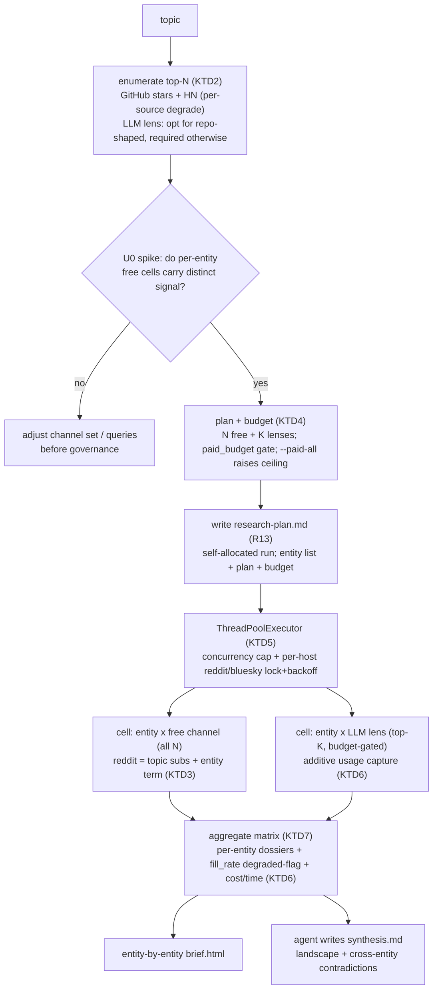

# Entity-Fan-Out Deep Research Mode - Plan

**Target repo:** zbs-researcher (skill `deep-research`, paths repo-relative). Depth: Deep.

> **Deepened 2026-07-21** after a doc-review pass grounded in the real engine. The review found the original draft's "connectors untouched + real token counts" pair contradictory, the `import deep-research` mechanism unbuildable (hyphen), the free-channel per-entity depth premise unvalidated (`channel_reddit` is topic-shaped), and the enumeration biased to open-source repos. Those are resolved below; a premise-validation spike (U0) now gates the governance machinery.

---

## Goal Capsule

- **Objective.** Turn the runner from a broad-scan into an actual deep researcher. Today `deep-research.py` sends ONE blanket query per channel ("LLM agent memory" → one Grok blob, one Gemini blob, one Reddit blob). The real shape: **enumerate the top-N entities** for a topic, **query EACH entity across every channel**, **aggregate an entity×channel dossier matrix**, then **synthesize the landscape** from the dossiers.
- **Product authority.** Nikita. This is the core-product correction — the single-blanket-query output is "хуйня" for real research; per-entity fan-out is what makes it deep.
- **Chosen shape (confirmed this session):** hybrid tiering — enumerate top-N (≈50); run the **free** channels on **every** entity; run the **paid** LLM lenses (Grok/Gemini/Perplexity) on the **top-K** (≈10) only. Paid-on-all-N is opt-in.
- **Prove depth before building the governor (U0).** The biggest risk is that per-entity free-channel cells are thin or redundant (an entity-name query to `channel_github` returns the same repo enumeration already found; `channel_reddit` finds no subreddit named after "Mem0"). U0 is a throwaway spike that fans a handful of entities across the channels and checks each cell carries *entity-specific* signal distinct from the topic/enumeration query. The full tiering/budget/backoff apparatus (U3–U5) is gated on U0 reading as clearly deeper than the blanket-query baseline.
- **Honest floor.** This mode is deliberately **not** $0 or 40s. Free-channel fan-out over 50 entities is minutes of wall time; the top-K paid lenses cost real vendor tokens. The mode reports token usage, paid-call count, and wall time — and flags a run as **degraded** (not "complete") when a channel's cells mostly failed to rate limits. Tier-0 (free channels only, no lenses) stays genuinely free.

---

## Product Contract

### Primary actor & core outcome

- **Primary:** the researcher (Nik / his client) who wants a real landscape, not four channel blobs. **Secondary:** the agent driving the run; the demo/launch audience seeing the depth.
- **Core outcome:** run one topic and get back an **entity-by-entity dossier matrix** — top-N systems/projects/people, and for each, what every channel actually found (X quotes with handles, YouTube talks, subreddit posts, repo stars/velocity, HN stories) — plus a synthesized landscape drawn from the dossiers.
- **Entity-quality honesty.** The zero-key enumeration floor (GitHub stars + HN) guarantees good entity lists only for **repo-shaped** topics. For product- or people-shaped topics (e.g. "AI companion apps": Character.ai, Replika, Pi — none with a ranking repo), entity quality depends on the LLM enumeration lens, which becomes **mandatory** for those topics (R1). The output states which enumeration sources produced the list so the reader can judge coverage.

### Requirements

**Enumeration & fan-out (the shape)**

- R1. **Enumerate top-N entities** by merging free sources — GitHub top-repos-by-stars (existing `gh_api`) + HN mentions — into a canonical, deduped, ranked entity list (name, aliases, type, rank, sources). Works with **zero paid keys** on GitHub+HN alone for repo-shaped topics; for non-repo-shaped topics an LLM enumeration lens is required (and the output labels the run accordingly). Each enumeration source degrades independently — a source failing (e.g. `gh_api` 403) is recorded and skipped, never aborts the run.
- R2. **Fan out per entity** — for EACH entity, run a **per-entity** query in each selected channel. The query is the entity name/aliases, *except* where a channel needs a topic-scoped strategy to return entity-specific signal (reddit — see KTD3). Not one blanket topic query per channel.
- R3. **Hybrid tiering** — **free** channels (reddit/arctic-shift, bluesky, github, github-issues, hackernews) run on **all N** entities; **paid** LLM lenses (grok, gemini, perplexity) run on the **top-K** only. `--paid-all` opt-in lifts lenses to all N *and* raises the paid budget so the opt-in is not silently trimmed back (R7).
- R8. **Aggregate an entity×channel dossier matrix** — per entity, a dossier of what each channel found. Per-cell graceful `ERROR.md` degrade so one failed (entity, channel) cell never kills the matrix.
- R10. **Synthesize the landscape** from the dossiers (per-entity + cross-entity contradictions), not from channel blobs. Synthesis runs in the Claude session per the existing model; the tool produces the matrix + `research-plan.md` and the agent writes `synthesis.md`.

**Cost, safety & limits (the constraints Nik named)**

- R4. **Bounded N and K** — CLI/config with sane defaults (N=50, K=10) and hard caps to prevent runaway.
- R5. **Concurrency cap** on parallel (entity, channel) calls — `concurrent.futures.ThreadPoolExecutor` (stdlib, Windows-safe: no `signal.SIGALRM`/`os.killpg`/`fcntl`/`pty`/`os.fork`).
- R6. **Rate-limit backoff** for reddit/bluesky (already 403 under load) — per-host pacing + exponential backoff on 429/403; honest degrade, never hammer. A per-channel **fill-rate threshold** marks the run degraded when a channel's ERROR cells exceed a set fraction.
- R7. **Per-run budget cap** — an explicit ceiling on paid LLM-lens calls (default = `K × len(available_lenses)`); never exceeded without `--paid-all` (which raises the ceiling to `N × len(available_lenses)`) or an explicit `--paid-budget`. The plan step reports the exact call budget before firing.
- R9. **Honest cost/time reporting** — the manifest + output record real per-cell wall time, paid-call count, and token usage. Token usage is **size-based estimate by default** (labeled `est`); **real** vendor token counts are captured only when the lens channels are extended to surface their `usage` block (KTD6) — the output labels each number `real` or `est`. No "$0 / 40s"; and no "complete" label on a rate-limit-degraded run.

**Compatibility & structure**

- R11. **Reuse, don't rewrite** — the existing `Connector` registry, `channel_*` functions, `rank_items`, `output_paths`, and the HTML brief renderer. Fan-out is a **new orchestration mode layered on top**. The only connector-code change permitted is the *additive, behavior-preserving* usage return on the three lens channels (KTD6); the single-query path stays byte-identical (verified by characterization test).
- R12. **New CLI surface** — `--mode entity-fanout` (with `--entities-n`, `--top-k`, `--concurrency`, `--paid-budget`, `--paid-all`). The default single-query mode is **unchanged** (back-compat; existing tests/selftest stay green).
- R13. **Plan-first preserved** — the mode **self-allocates** its run dir and writes `research-plan.md` (the enumerated entity list + the per-entity channel plan + the computed call budget) BEFORE firing any fan-out, and `synthesis.md` + `brief.html` after. It does not consume an agent-prepared run (that path stays exclusive to single mode); the SKILL.md marker contract gains an entity-fanout-aware branch (U8).

### Scope boundaries

**In scope (v1)**
- Premise-validation spike (U0)
- Enumeration (GitHub+HN merge with per-source degrade, LLM enrichment/mandatory-for-non-repo) (R1)
- Per-entity fan-out orchestrator with concurrency + backoff + budget (R2–R7)
- Entity×channel matrix aggregation + honest cost/time manifest + degraded-run flagging (R8, R9)
- CLI mode + plan-first + entity-matrix HTML brief (R10–R13)

**Non-goals / Deferred to Follow-Up Work**
- Cross-run entity memory / dedup across historical runs — each run enumerates fresh.
- Automatic K-tuning / adaptive budget — K and budget are explicit inputs in v1.
- Telegram/Threads/TikTok/Meta-Ads per-entity fan-out — v1 fans out the free channels + the three LLM lenses; the opt-in vendor sources join later behind their existing gates.
- A dedicated entity-graph / relationships view — v1 is a per-entity dossier matrix, not a graph.
- Dollar-cost figures — v1 reports token usage + call counts + wall time, not a priced $ total (no vendor price map in-tool).

---

## Planning Contract

Key Technical Decisions:

- KTD1. **New orchestrator module `entity_fanout.py`; the runner injects, it does not import.** `deep-research.py` has a hyphen, so `import deep-research` is impossible — the codebase already solves this: `connectors/__init__.py` documents "a plain import back into it is impossible" and uses `attach_runner()` to inject the runner globals. `entity_fanout.py` follows the same pattern: `deep-research.py`'s `--mode entity-fanout` branch calls an `entity_fanout` entrypoint, passing the registry + helpers it needs (`CONNECTORS`, the `channel_*` callables, `rank_items`, `get_json`/`post_json`, `read_key`/`KEYS`, `output_paths`, `gh_api`) — or reuses `connectors.attach_runner(globals())`. No import-by-name of the hyphenated module.
- KTD2. **Enumeration is a MERGE with per-source degrade, keyed to topic shape.** Free primary sources: GitHub `search/repositories?q=<topic>&sort=stars` (existing `gh_api`, already ranked) + HN Algolia stories mentioning the topic. Each source is independently `try/except`'d; a 403/429/parse failure is recorded and skipped, enumeration proceeds on survivors, and zero entities is a documented clean no-op (not an exception). Optional/mandatory LLM enrichment: one lens call "list the top N <topic> systems/projects/people" — **optional** for repo-shaped topics, **required** for product/people-shaped topics (heuristic: if the GitHub source yielded < a threshold of confidently topic-matching repos, treat the topic as non-repo-shaped and require the LLM lens; if no lens key is present, emit the run with an explicit "repo-shaped entities only — coverage may miss closed-source/people" caveat). Dedup: normalize name (lowercase, strip org prefix) + a **seed alias map** (a small curated table, e.g. `MemGPT`↔`Letta`) **augmented by LLM-derived aliases** produced at enumeration time when a lens is present; without a lens, dedup is normalized-name-only and the claim is "normalized-name deduped", not "canonical". Rank by blended score (stars + HN mention count + LLM rank when present). Output: ordered `[{name, aliases, type, rank, sources}]` capped at N.
- KTD3. **Per-cell execution reuses the channel signature, with a reddit-specific strategy.** Each `channel_*(query, out_path, max_items)` is called with the entity as the query — for bluesky/github/github-issues/hackernews the entity name/aliases works directly. **Reddit is topic-shaped**: `channel_reddit` first runs `_arctic_shift_discover_subreddits(query)`, which prefix-matches the query against subreddit *names* — an entity like "Mem0" rarely has an eponymous subreddit, so a naive per-entity reddit query returns "No posts pulled". So reddit fan-out discovers the topic's subreddits **once** (from the topic, not the entity), then queries each entity as an in-subreddit search term across those subreddits. Per-cell output: `<run>/entities/<entity-slug>/<channel>.md` (slug is filesystem-safe: lowercase, non-alnum → `-`, collapse, bounded length, so names like `owner/repo` or `C++` are safe). Per-cell failure writes `<channel>.ERROR.md` and the matrix continues (same degrade contract as `run_connector`).
- KTD4. **Tiering + budget computed up front, `--paid-all` raises the ceiling.** Before firing, build the exact cell list: `N × free-channels` (always) + `K × available_lenses` (top-K; `--paid-all` → `N × available_lenses`). The hard `paid_budget` defaults to `K × len(available_lenses)`; `--paid-all` raises it to `N × len(available_lenses)` (so the opt-in is never trimmed back), and `--paid-budget` sets it explicitly. If the computed paid cells exceed the budget, trim to budget keeping highest-rank entities and record the trim. Lenses with no key are absent (never counted). Free cells are never gated.
- KTD5. **`ThreadPoolExecutor` + per-host pacing.** Drain the (entity, channel) cell list with `concurrent.futures.ThreadPoolExecutor(max_workers=--concurrency)` (default 6) — stdlib, Windows-safe (no fork/signal), enforces the cap natively; submit one future per cell, gather as they complete, update the manifest under a lock. Per-cell backoff runs *inside* the cell runner and composes with the executor. Because a shared pool won't serialize a single host, reddit and bluesky each get a **per-host `threading.Lock`/semaphore** so their cells pace (reuse the arctic-shift `time.sleep(0.5)` cadence) rather than bursting; on 429/403 the cell backs off (deterministic base × 2^attempt, small retry cap) then degrades to `ERROR.md`. Backoff/pacing sleeps are injectable so tests don't sleep real seconds.
- KTD6. **Cost/time accounting: estimate by default, real when the lens surfaces usage.** Each cell records `{entity, channel, seconds, output_size, status}`. Today the `channel_*` lens functions return only `len(text)` and discard the vendor `usage`/`usageMetadata` — so real token capture requires an **additive, behavior-preserving** change: the three lens channels optionally surface their usage block (e.g. return `(count, usage|None)` or set a passed-in accumulator) without altering their written output or their single-query return contract (characterization test guards byte-compat). When usage is present the manifest counts it `real`; otherwise it estimates from output size labeled `est`. The manifest aggregates: `paid_calls`, `tokens_real`, `tokens_est`, `wall_seconds`, `entities`, `cells_ok`, `cells_error`, and per-channel `fill_rate`. The output states these numbers and never claims $0.
- KTD7. **Aggregation = entity×channel matrix + degraded-run flag.** After the pool drains, build per-entity dossiers (entity → {channel → ranked findings/status}) and a matrix index. Compute per-channel `fill_rate` (ok cells / total cells); if any free channel's ERROR fraction exceeds a threshold (default 0.5), mark the run `degraded` in the manifest and brief (so a hollow rate-limited matrix is never presented as "complete"). The HTML brief renders **entity-by-entity** (reuse `markdown_to_html`'s existing table support where a markdown matrix table suffices), not channel blobs. `research-plan.md` is written before firing; `synthesis.md` is authored by the agent from the matrix.

---

## High-Level Technical Design



Matrix shape (directional): rows = entities (Mem0, Zep, Letta, Cognee…), columns = channels (X/grok, YouTube/gemini, reddit, github, hn…); each cell = that channel's ranked findings for that entity, or an honest ERROR/empty.

---

## Alternatives Considered

- **LLM-produces-the-dossier (rejected as default, kept as fallback).** Instead of mechanical per-entity fan-out across all free channels, let the LLM lens produce both the enumeration *and* a per-entity dossier in a few calls, with free channels only corroborating the top-K. Cheaper and arguably deeper for non-repo topics — but it defeats the zero-key value prop (no lens key → no research) and launders vendor summaries instead of surfacing primary reactions from real humans (the product's whole point). Kept as the **non-repo enumeration path** (KTD2) but not the dossier mechanism. U0 is the cheap check that the mechanical free-channel dossier actually beats this.
- **Paid lenses on all N (rejected as default).** Deepest, but cost/rate-limits make it runaway at N=50. Kept behind `--paid-all` (R3/R7).
- **Hand-rolled worker pool (rejected).** The original draft hand-rolled a queue+worker+`Event` pool; `concurrent.futures.ThreadPoolExecutor` is stdlib, Windows-safe, and enforces the cap for free (KTD5).

---

## Output Structure

New/changed files.

```text
skills/deep-research/scripts/
├── deep-research.py            # + --mode entity-fanout branch; additive usage return on 3 lens channels (byte-compat)
├── entity_fanout.py            # NEW — enumerate → (U0 gate) → plan/budget → pool → aggregate orchestrator
├── selftest.sh                 # + entity-fanout dry-run (free-only, bounded N) smoke
└── SKILL.md                    # + entity-fanout mode section + marker branch
skills/deep-research/tests/
├── test_entity_enumerate.py    # NEW — merge/dedup/rank, per-source degrade, zero-key path, non-repo caveat
├── test_entity_fanout.py       # NEW — cell list, tiering, budget cap + --paid-all, concurrency, per-host backoff, per-cell degrade, reddit strategy
└── test_entity_matrix.py       # NEW — aggregation, fill_rate degraded-flag, cost/time manifest, usage real-vs-est
README.md                       # + entity-fanout mode blurb
CONFIGURATION.md                # + the new flags
```

---

## Implementation Units

| U-ID | Title | Key files | Depends on |
|---|---|---|---|
| U0 | Premise-validation spike (throwaway) | `entity_fanout.py` (spike), scratch output | — |
| U1 | Entity enumeration (merge + per-source degrade) | `entity_fanout.py` | U0 |
| U2 | Fan-out orchestrator + ThreadPoolExecutor + reddit strategy | `entity_fanout.py` | U1 |
| U3 | Tiering + paid-budget cap + `--paid-all` | `entity_fanout.py` | U2 |
| U4 | Per-host rate-limit backoff (reddit/bluesky) | `entity_fanout.py` | U2 |
| U5 | Aggregation + fill_rate degraded-flag + cost/time manifest + additive usage capture | `entity_fanout.py`, `deep-research.py` (lens usage) | U2, U3 |
| U6 | CLI wiring + self-allocated plan-first + back-compat | `deep-research.py`, `entity_fanout.py` | U1–U5 |
| U7 | Entity×channel HTML brief | `deep-research.py` (renderer) or `entity_fanout.py` | U5 |
| U8 | Docs + SKILL.md marker branch + selftest smoke | `selftest.sh`, `SKILL.md`, `README.md`, `CONFIGURATION.md` | U1–U7 |

### U0. Premise-validation spike (throwaway)

- **Goal:** Before building the governance machinery, confirm that a per-entity free-channel query returns signal *distinct* from the topic/enumeration query — i.e. the fan-out is actually deeper, not 250 thin/redundant cells.
- **Requirements:** validates R2 before R3–R9 are built
- **Dependencies:** none (may stub enumeration with a hardcoded 5-entity list)
- **Files:** `skills/deep-research/scripts/entity_fanout.py` (spike code, removed/folded before done), scratch output dir
- **Approach:** Take ~5 known entities for one topic (e.g. Mem0, Zep, Letta, Cognee, MemGPT). For each, call each free channel with the entity query (reddit via the KTD3 topic-subs strategy) and eyeball/diff the output vs the topic-level query: does `channel_github("Mem0")` add anything over the enumeration hit? does `channel_hackernews("Zep")` return entity-specific stories? does the reddit strategy find entity mentions? Record which channels carry entity-specific signal and which are redundant/empty.
- **Execution note:** This is a spike — live free calls are fine, no tests. Its output is a go/no-go note folded into U1/U2 decisions (e.g. drop a channel from the free tier if it's always redundant, or confirm the reddit strategy). Delete the spike code before U6.
- **Test scenarios:** Test expectation: none — throwaway spike; its finding gates the channel set for U2.
- **Verification:** A short written finding: per free channel, "entity-specific signal: yes/redundant/empty", and a decision on the v1 free-channel set. If a channel is always redundant with enumeration, it's dropped from the free fan-out (recorded in U2).

### U1. Entity enumeration (merge + per-source degrade)

- **Goal:** Turn a topic into a canonical, ranked, deduped top-N entity list from free sources, richer/mandatory-LLM for non-repo topics, with each source degrading independently.
- **Requirements:** R1, R11
- **Dependencies:** U0 (channel/enumeration findings)
- **Files:** `skills/deep-research/scripts/entity_fanout.py` (enumerate functions), `skills/deep-research/tests/test_entity_enumerate.py` (new)
- **Approach:** `enumerate_entities(topic, n, keys)` merges independently-guarded sources: (a) GitHub `search/repositories?sort=stars` via injected `gh_api` → repo `full_name`/description as entities; (b) HN Algolia stories mentioning the topic → surfaced names; (c) LLM "top N <topic>" call (perplexity/gemini) — optional for repo-shaped, required for non-repo-shaped (threshold heuristic in KTD2). Each source `try/except`'d: failure recorded in a `sources` report, skipped, never raised. Normalize names + seed alias map + LLM-derived aliases (when lens present) for dedup; without a lens, normalized-name dedup only (claim downgraded). Rank by blended score. Return `[{name, aliases, type, rank, sources}]` capped at N, plus a `coverage` note (repo-shaped-only caveat when no lens ran on a non-repo topic).
- **Execution note:** Free-first — GitHub+HN must produce a usable list with zero paid keys for repo-shaped topics; the LLM call enriches or (for non-repo topics) is required. Live GitHub/HN calls are fine; tests mock them.
- **Patterns:** injected `gh_api`/`channel_github` (repo-by-stars), `channel_hackernews` (Algolia); `rank_items` for blended ranking.
- **Test scenarios:** Happy: topic → merged list, GitHub repos + HN names deduped, ranked, capped at N. Zero-key repo-shaped: only GitHub+HN → valid ranked list, no LLM call attempted. Per-source degrade: `gh_api` raises 403 → recorded in `sources`, HN still contributes, run does not abort; HN raises → GitHub still contributes. Zero entities from all sources → clean empty result, no exception. Non-repo topic + no lens key → result carries the "repo-shaped only" coverage caveat. Non-repo topic + lens key → LLM enumeration runs. Dedup with lens: alias-derived collapse; **without** lens: only normalized-name dedup (test asserts general normalized dedup, not just the one seed pair). Cap: more than N → exactly N.
- **Verification:** Mocked fixtures: deduped ranked list ≤N with zero paid calls on the repo-shaped path; a failing source degrades without aborting; the non-repo caveat appears when appropriate.

### U2. Fan-out orchestrator + ThreadPoolExecutor + reddit strategy

- **Goal:** For each entity, run each selected channel as a separate cell, concurrently but capped, with per-cell graceful degrade and the reddit topic-subs strategy.
- **Requirements:** R2, R5, R8, R11
- **Dependencies:** U1
- **Files:** `skills/deep-research/scripts/entity_fanout.py` (cell model + executor), `skills/deep-research/tests/test_entity_fanout.py` (new)
- **Approach:** Build the cell list `[(entity, channel)]` (free channels from the U0-confirmed set). Drain with `concurrent.futures.ThreadPoolExecutor(max_workers=concurrency)`; each cell calls the injected `channel_fn(entity_query, out_path, max_items)` writing `<run>/entities/<slug>/<channel>.md`, and on exception writes `<channel>.ERROR.md` (mirror `run_connector`'s degrade). Reddit cells use the KTD3 strategy: discover the topic's subreddits once (shared across reddit cells), then query each entity as an in-subreddit term. Manifest updates under a lock. Slug is filesystem-safe.
- **Execution note:** Characterize the reuse — cells call the SAME `channel_*` functions single-query mode uses, with the entity as the query (assert call shape with a mock). No `os.fork`/`signal`.
- **Patterns:** existing `run_connector` (try/except → ERROR.md, manifest under lock), the `threading` fan in `main()`, `_arctic_shift_discover_subreddits` for the reddit topic-subs step.
- **Test scenarios:** Happy: 3 entities × 2 channels → 6 cells, each channel fn called once with the entity query, 6 output files. Concurrency cap: `max_workers=2`, 6 cells → never >2 in flight (counting mock). Per-cell degrade: one channel fn raises → that cell writes `ERROR.md`, other 5 succeed. Reddit strategy: topic-subs discovered once (assert `_arctic_shift_discover_subreddits` called with the topic, not per-entity), entities queried within those subs. Empty entity list → no cells, clean no-op. Windows: no POSIX-only calls (grep).
- **Verification:** All cells run once, concurrency never exceeds the cap, a failing cell degrades without killing siblings, reddit uses topic-subs discovery.

### U3. Tiering + paid-budget cap + `--paid-all`

- **Goal:** Free channels on all N; paid lenses on top-K; a hard budget ceiling that `--paid-all` raises rather than fights.
- **Requirements:** R3, R4, R7
- **Dependencies:** U2
- **Files:** `skills/deep-research/scripts/entity_fanout.py` (cell-list builder + budget gate), `skills/deep-research/tests/test_entity_fanout.py`
- **Approach:** Classify channels into `free` and `paid_lenses` (grok/gemini/perplexity). Cell-list builder: free × all N; paid lenses × top-K (`--paid-all` → paid × all N). `paid_budget` defaults to `K × len(available_lenses)`; `--paid-all` raises it to `N × len(available_lenses)`; `--paid-budget` overrides. If paid cells exceed the budget, trim to budget (highest-rank entities), record the trim. Keyless lenses absent (never counted). Free never gated.
- **Patterns:** existing `select_connectors` live/skip split; `Connector.available()`/`missing_keys()` for lens presence.
- **Test scenarios:** Hybrid default: N=5, K=2, free={reddit,github}, lenses={grok,gemini} → 10 free + 4 paid (top-2 × 2). `--paid-all`: paid budget raised → 10 paid cells (all 5 × 2), **not** trimmed to 4 (regression guard for the budget-trim-defeats-opt-in bug). Explicit `--paid-budget=2` with 4 would-be paid cells → exactly 2 paid, trim recorded, top-rank kept. Lens absent: only grok key → gemini cells never created, `available_lenses` reflects it. Free never gated: budget=0 → 0 paid cells, all free cells still run.
- **Verification:** Cell counts match the tiering math; `--paid-all` is not trimmed back; paid cells never exceed the resolved budget; free cells independent of budget.

### U4. Per-host rate-limit backoff (reddit/bluesky)

- **Goal:** Fan-out over N entities must not hammer reddit/bluesky into 403; pace per host, back off, degrade honestly.
- **Requirements:** R6
- **Dependencies:** U2
- **Files:** `skills/deep-research/scripts/entity_fanout.py` (per-host pacing + retry), `skills/deep-research/tests/test_entity_fanout.py`
- **Approach:** A per-host `threading.Lock` (or bounded semaphore) for reddit and for bluesky so their cells serialize/pace (arctic-shift `time.sleep(0.5)` cadence) even inside the shared executor; on HTTP 429/403, deterministic exponential backoff (base × 2^attempt, small retry cap), then degrade the cell to `ERROR.md`. Coordinate with `channel_reddit`'s own built-in 429 retry so waits don't uncontrollably compound. Pacing/backoff clock is injectable.
- **Execution note:** Windows-safe timing only (`time.sleep`, no `signal`); injectable clock so tests don't sleep seconds.
- **Patterns:** the arctic-shift retry/pacing in `channel_reddit`; `run_connector`'s HTTPError → ERROR path.
- **Test scenarios:** 429 then success: a reddit cell gets 429 once → backs off (injected sleep recorded) → retries → succeeds. Persistent 403: exceeds retry cap → degrades to `ERROR.md`, siblings continue. Per-host pacing: N reddit cells serialize on the reddit lock (assert the injected delay invoked between them); github/hn cells don't pay reddit pacing and aren't blocked by the reddit lock. No real multi-second sleeps (injected clock).
- **Verification:** Throttled hosts pace/back off deterministically per-host; a persistently-throttled cell degrades cleanly; non-throttled channels unaffected and not starved.

### U5. Aggregation + fill_rate degraded-flag + cost/time manifest + additive usage capture

- **Goal:** Build the entity×channel dossier matrix, flag a rate-limit-degraded run, and record honest cost/time/token accounting with real usage when available.
- **Requirements:** R8, R9, R11
- **Dependencies:** U2, U3
- **Files:** `skills/deep-research/scripts/entity_fanout.py` (aggregate + manifest), `skills/deep-research/scripts/deep-research.py` (additive usage return on the three lens channels), `skills/deep-research/tests/test_entity_matrix.py` (new)
- **Approach:** After the pool drains, assemble per-entity dossiers (entity → {channel → ranked findings/status}) and a matrix index. Compute per-channel `fill_rate`; mark the run `degraded` when a free channel's ERROR fraction exceeds the threshold. Each cell recorded `{seconds, output_size, status}`; lens cells capture real usage via the **additive, behavior-preserving** lens-channel change (return `(count, usage|None)` or fill a passed accumulator) — the single-query return path is byte-preserved (characterization test). Manifest aggregates `paid_calls`, `tokens_real`, `tokens_est`, `wall_seconds`, `entities`, `cells_ok`, `cells_error`, per-channel `fill_rate`, `degraded`.
- **Execution note:** The lens-channel usage change is the ONE permitted connector edit (R11) — keep it additive; add a characterization test asserting single-query output/return is unchanged.
- **Patterns:** existing `manifest.json` writing in `main()`; `output_paths` for the run dir; `rank_items` for per-cell ranking; the lens response dicts (`usageMetadata`/`usage`) already parsed for citations in `channel_gemini`/`channel_perplexity`/`_channel_via_openrouter`/`channel_grok`.
- **Test scenarios:** Matrix build: mocked cells → per-entity dossiers with correct channel→status; ERROR cells appear as `error`, not dropped. fill_rate/degraded: a channel with >50% ERROR cells → `degraded=true` in manifest; healthy run → `degraded=false`. Real usage: a lens cell whose mocked response carries `usage` → counted in `tokens_real`; one without → `tokens_est` from size, labeled. Byte-compat: characterization test — single-query lens call output file + return value unchanged by the additive usage change. Cost aggregate: `paid_calls` = lens cell count; free-only run → `paid_calls=0`, `tokens_real=0`. Honesty: no field claims $0 when a paid cell ran.
- **Verification:** Matrix reflects every cell (ok + error); degraded flag fires on rate-limit holes; token numbers split real vs est; single-query path proven byte-identical.

### U6. CLI wiring + self-allocated plan-first + back-compat

- **Goal:** Expose the mode, self-allocate the run and write `research-plan.md` first, keep the default single-query mode unchanged.
- **Requirements:** R4, R12, R13
- **Dependencies:** U1–U5
- **Files:** `skills/deep-research/scripts/deep-research.py` (argparse + `--mode entity-fanout` branch), `skills/deep-research/scripts/entity_fanout.py` (entrypoint), `skills/deep-research/tests/test_entity_fanout.py`
- **Approach:** Add `--mode {single,entity-fanout}` (default `single` = today's behavior, untouched), plus `--entities-n` (default 50, hard cap), `--top-k` (default 10), `--concurrency` (default 6), `--paid-budget`, `--paid-all`. On `entity-fanout`: **self-allocate** the run dir via `output_paths` (do NOT consume an agent-prepared run — that path stays single-mode only, so `validate_prepared_run_directory` is never involved), enumerate (U1), compute plan+budget (U3), **write `research-plan.md`** (entity list + per-entity channel plan + call budget) BEFORE firing, run the pool (U2/U4), aggregate (U5), render the brief (U7 once built). Validate flags (N/K/concurrency positive, K≤N, budget≥0).
- **Execution note:** Back-compat is a keystone — a `--mode single` (or no `--mode`) run must be byte-for-byte current behavior (characterization test). U7's renderer is the final pipeline step; until U7 lands, the mode still produces the matrix + plan.
- **Patterns:** existing argparse groups + `output_paths` allocation; the single-mode `--allocate-run`/`--prepared-run` flow is left intact and untouched.
- **Test scenarios:** Default unchanged: no `--mode` → today's single-query path (characterization; existing suite green). entity-fanout self-allocates its run and writes `research-plan.md` with entity list + budget BEFORE any cell fires (assert ordering + that no `--prepared-run` handshake is required). Flag validation: K>N → error; negative concurrency → error; `--entities-n` above hard cap → clamped, recorded. Plan-first: `research-plan.md` names resolved entities + call budget before fan-out.
- **Verification:** Default mode identical to today; entity-fanout self-allocates, writes the plan-with-budget first, then fans out; no prepared-run coupling.

### U7. Entity×channel HTML brief

- **Goal:** Render the matrix entity-by-entity, not as channel blobs, with the honest cost/degraded footer.
- **Requirements:** R8, R10, R11
- **Dependencies:** U5
- **Files:** `skills/deep-research/scripts/deep-research.py` (extend the HTML renderer) or `skills/deep-research/scripts/entity_fanout.py`, `skills/deep-research/tests/test_entity_matrix.py`
- **Approach:** Matrix-aware brief: rows = entities (ranked), each shows per-channel findings (X handles/quotes, YouTube titles, repo stars, HN stories) or an honest empty/error. Reuse the existing self-contained template (inline CSS, no external deps) and `markdown_to_html`'s table support where a markdown matrix table suffices. A per-run footer states the honest numbers from the manifest and a `degraded` banner when set.
- **Patterns:** existing `markdown_to_html`/`HTML_TEMPLATE` self-contained renderer (with markdown-table support); the `--render-html` path.
- **Test scenarios:** Matrix render: 3 entities × 3 channels → 3 entity rows, each with 3 channel cells; error cells rendered as an honest marker, not blank-dropped. Self-contained: no external `src=`/`@import` (grep). Cost footer: honest paid-call/token/time numbers appear; `degraded` banner shows when the manifest flag is set. Empty channel cell → "no signal" note, not a crash.
- **Verification:** Brief is entity-by-entity, self-contained, shows the honest cost footer and the degraded banner when applicable.

### U8. Docs + SKILL.md marker branch + selftest smoke

- **Goal:** Document the mode, add the entity-fanout-aware SKILL marker branch, and add a keyless smoke.
- **Requirements:** R11, R12, R13
- **Dependencies:** U1–U7
- **Files:** `skills/deep-research/scripts/selftest.sh` (entity-fanout dry-run), `skills/deep-research/SKILL.md` (mode section + marker branch), `README.md` (mode blurb), `CONFIGURATION.md` (the new flags)
- **Approach:** selftest: a bounded keyless entity-fanout dry-run (small N, free channels only, injected pacing) that asserts an entity list + a matrix + `research-plan.md` are produced with zero paid calls. Docs: SKILL.md gains an "entity-fanout mode" section AND an entity-fanout-aware branch of the ordered-marker contract (the mode self-allocates + self-writes `research-plan.md`, so the marker sequence differs from single mode's agent-driven `--allocate-run` flow); README a short blurb; CONFIGURATION the flags. Keep the single-mode ordered-marker contract and connector count intact.
- **Execution note:** Config/smoke unit — verify via selftest, not new unit tests (the units above carry the unit coverage). Ensure the selftest marker grep understands both mode branches.
- **Test scenarios:** Test expectation: mostly smoke via selftest — keyless entity-fanout dry-run yields entities + matrix + `research-plan.md`, zero paid calls; banned-POSIX grep stays clean over `entity_fanout.py`; existing single-mode ordered markers + connector count unchanged; the new entity-fanout marker branch is present.
- **Verification:** `bash skills/deep-research/scripts/selftest.sh` green including the new entity-fanout smoke and marker branch; docs describe the mode and flags.

---

## Verification Contract

- **Unit tests** for U1–U7 pass (`skills/deep-research/tests/`, the selftest discovery root; never discover from repo root). All mocked: enumeration sources + per-source degrade, per-cell channel calls, reddit topic-subs strategy, tiering/budget math + `--paid-all`, concurrency cap, per-host deterministic backoff, aggregation, fill_rate degraded-flag, usage real-vs-est, matrix render. No live paid calls.
- **Back-compat keystone:** a characterization test proves the default `--mode single` path is byte-identical to today, AND the additive lens-usage change leaves single-query lens output/return unchanged; the existing full suite stays green.
- **selftest.sh** green: keyless entity-fanout dry-run produces entities + matrix + `research-plan.md` with zero paid calls; banned-POSIX grep clean over `entity_fanout.py`; single-mode ordered markers + connector count intact + entity-fanout marker branch present; secret-scan clean.
- **Budget invariant:** a free-only entity-fanout run makes zero paid-lens calls (asserted); `--paid-all` is not trimmed back to top-K; no Anthropic/OpenAI API calls in tests.
- **Concurrency invariant:** in-flight cells never exceed `--concurrency` (asserted via counting mock).
- **Honesty invariant:** the manifest never reports `paid_calls`/tokens as zero when a paid cell ran; free-only runs report `paid_calls=0` truthfully; a rate-limit-degraded run is flagged `degraded`, never presented as complete.
- **Cross-platform:** Windows-safe (`ThreadPoolExecutor` + stdlib only, no POSIX-only calls) — covered by the selftest POSIX grep.

## Definition of Done

- U0's finding is recorded and the v1 free-channel set reflects it (redundant channels dropped, reddit strategy confirmed) — the depth premise is validated before the governance machinery shipped.
- Running `--mode entity-fanout "<topic>"` enumerates top-N entities (per-source-degrading, LLM-required for non-repo topics), fans out each entity across every selected channel (reddit via topic-subs strategy), and produces an **entity×channel dossier matrix** + self-allocated `research-plan.md` (written first) + an entity-by-entity `brief.html` — not four channel blobs.
- Hybrid tiering holds: free on all N; paid lenses on top-K (or all N with `--paid-all`, which raises the budget so it is not trimmed back); the paid-budget cap is never exceeded otherwise.
- Concurrency is capped via `ThreadPoolExecutor`, reddit/bluesky pace per-host and back off, and any single (entity, channel) cell can fail to `ERROR.md` without killing the matrix; a rate-limit-hollow run is flagged `degraded`.
- The manifest/brief report **real** paid-call count, token usage (real when the lens surfaces `usage`, else labeled `est`), and wall time — never "$0 / 40s". A free-only run truthfully reports `paid_calls=0`.
- Zero paid keys still yields a real matrix from GitHub+HN enumeration + free-channel fan-out for repo-shaped topics; non-repo topics carry the coverage caveat.
- The default single-query mode is unchanged; the additive lens-usage change is byte-compat on the single-query path; the full existing suite + selftest stay green; `entity_fanout.py` is Windows-safe/stdlib-only.
- The U0 spike code and any abandoned dead-end code are removed before declaring done.
